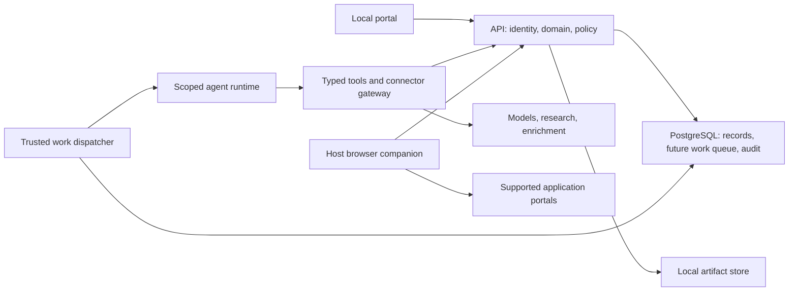
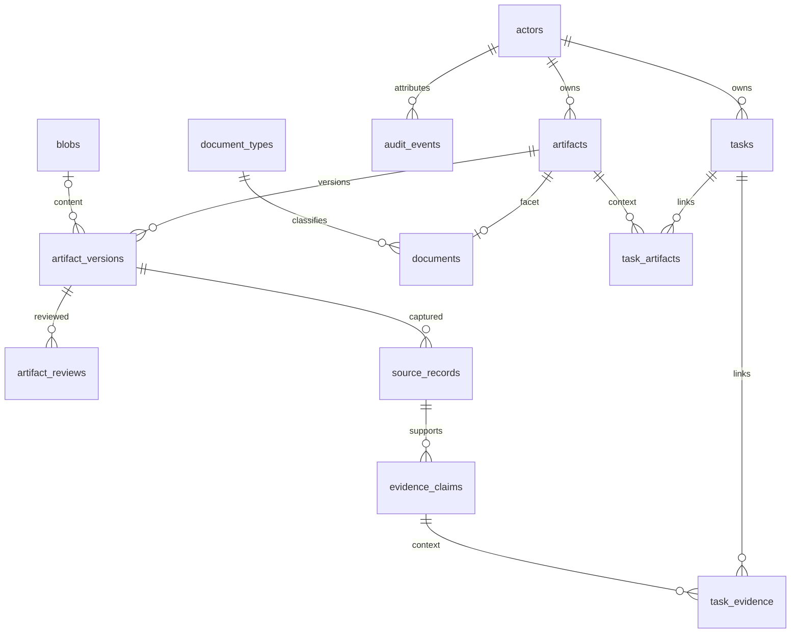

# Command Center — Tech Spec

**Revision:** 2026-09-21-r5. **Status:** foundation implementation authorized; unresolved product choices remain labelled.

This is the single technical source, absorbing the former Planning Doc's architecture, the additional Notion technical section, agent plan and reference learnings. [Product Spec](product-spec.md) owns behavior and release acceptance. [engineering.md](tech/engineering.md) owns build sequence, file/test contracts and delivery evidence. [design.md](tech/design.md) owns the interface. Historical copies are not competing specifications.

## 1. Architecture direction

### Connected workspace authorized

Durable agent direction: provide a configurable local OpenAI/LangGraph harness inspired by Deep Agents, optional Composio tool discovery/execution, and a browser-extension bridge to the authenticated container API. Clerk is the shared human identity across Next.js and FastAPI. Provider secrets live in ignored root `.env` and `apps/web/.env` and never in client bundles, agent prompts or memory. Browser sessions remain on the host. Extension pairing produces a separately revocable, actor-bound device credential; commands carry an explicit site/action scope and durable outcome. Agent code must not infer permissions from source pages or model output. Existing product-policy questions still govern autonomous campaigns and consequential external actions.

The user requests the Next.js/shadcn product interface now, using `mockups/` and trycrm.ai, with Clerk authentication and synchronized FastAPI endpoints. Add actor-owned companies, contacts, jobs, opportunities and candidate profile/preferences; expose tasks, artifacts/versions/reviews and audit through authenticated controllers. Clerk session JWTs are verified by FastAPI against a configured issuer/JWKS and authorized origins. The browser calls a same-origin Next.js forwarding route that supplies the verified Clerk session token; no database credential or server API secret enters the browser.

Mutable requests require an Idempotency-Key, persist an actor-scoped request hash/result in the same transaction as the model change, and reject key reuse with different input. New row UUIDs derive from actor, resource and that key; row IDs are stable across retries, while mutable records retain optimistic revisions. User-provided actor IDs never grant access. All reads and foreign references are scoped to the authenticated actor.

PostgreSQL stays the database. Support separate runtime and migration URLs, TLS query parameters and Supabase session/transaction poolers without requiring a second auth system. Alembic remains the single schema-history owner. Public-schema application tables have RLS enabled with no public Data API policies; access stays through FastAPI and its server-side DB role. A later Supabase deployment requires selected project credentials and validated migration/restore, not a silent production migration.

### Implemented agent and browser slice

Celery/Redis handles dispatch while `agent_runs` is the authoritative PostgreSQL ledger. Atomic claims, leases and fenced checkpoints reject duplicate deliveries and stale completion. Interrupted runs fail explicitly rather than silently repeating paid or external work. LangGraph implements a bounded ReAct loop with OpenAI models. `agents/profiles.toml` and Markdown skills are snapshotted by revision. Agent tools discover through the internal authenticated Streamable HTTP `/mcp/` endpoint using `langchain-mcp-adapters`; discovery is scoped to the run's saved grants. The MCP server uses a separately scoped API token for existing FastAPI endpoints. Tokens are short lived, require a live lease and never enter model messages. Composio schemas/actions are explicitly allowlisted and version pinned; account connection uses the actor UUID.

`memory_items` stores human/agent notes and preferences, with revisions and audit. It is not a fact-verification or authorization system. The Chromium extension uses activeTab and a revocable device credential; sharing captures field descriptions without existing values or cookies. Fill proposals bind the device, owner, snapshot and current document. Manual Apply claims once, validates fields before filling and reports applied/rejected/failed/unknown outcomes. This first implementation does not submit, upload or drive arbitrary browser actions. Production campaigns remain governed by Product Spec Q5–Q10.

Vercel AI Elements supplies generated Markdown, conversation and tool-result components over the existing API. Eve was evaluated on 2026-09-21; it would be a separate TypeScript durable-session runtime, so it is not installed alongside the selected LangGraph/Celery stack. The UI design review is recorded in `docs/tech/design.md`.

### Foundation slice authorized 2026-09-21

The user requested FastAPI, SQLAlchemy/Alembic migrations, Docker Compose, a Next.js React application, clean module organization, and Docker Firecrawl/SearXNG connections. Implement the local foundation now; Product Spec Q5–Q10 still gate their dependent product workflows.

The user subsequently selected PostgreSQL in Compose, reuse of the existing Firecrawl/SearXNG Docker services, backend/data-model work before interface design, and Rails-inspired fat models/thin controllers. Mockup pictures are reserved for the later web and extension surfaces.

The foundation now extends to the connected workspace: Clerk identity, CRM/task/profile/artifact APIs, immutable versions/reviews, browser pairing and manual-fill proposals, memory and agent runs. The original generated bearer secret remains a diagnostic credential and signing key for internal run capabilities; human workspace access uses Clerk. Imports and autonomous application execution remain later workflows.

Use `apps/api/` for Python routes, settings, expressive SQLAlchemy models and provider adapters, and `apps/web/` for Next.js App Router with TypeScript. Model methods own behavior; controllers adapt HTTP and establish transaction boundaries. Do not introduce generic repositories or services around the ORM. Network I/O stays in provider clients outside database transactions. Next.js may use server rendering without becoming a second domain backend. Connector status is diagnostic and never enables an autonomous campaign.

Use a standalone local application with a typed API, web portal, Celery/Redis workers, local record/artifact storage and a paired host browser companion. The selected foundation is FastAPI, SQLAlchemy/Alembic, PostgreSQL 17, Next.js/React/TypeScript and Docker Compose. PostgreSQL supersedes the earlier SQLite/FTS5 proposal. Exact Python and JS dependencies are recorded in `apps/api/uv.lock` and `apps/web/package-lock.json`. Clerk is selected and implemented across Next.js and FastAPI. Comp AI is an architectural reference, not a fork or a mandate to adopt its stack.

The API validates state changes, applies policy and appends audit records in the same transaction. Long model/research/browser work belongs outside request handlers. The trusted dispatcher owns queue mechanics; the agent sandbox gets scoped tools/artifacts rather than raw database credentials or unrestricted network/shell access. A trusted domain tool may access storage internally; the phrase “worker has no database access” must not obscure these different roles.

The browser companion operates where the selected Chrome session exists. It receives application packages through an authenticated API, reports events and outcomes, and cannot expand its own authority. Do not mount the Docker socket, full home directory or browser-profile store into the API container. Bind published local ports explicitly, authenticate loopback access, and separate any later remote/LAN deployment decision.

## 2. Domain model and boundaries

Use typed operational records plus a shared work-product lifecycle. Avoid both a resume/outreach-specific parallel store and a single unstructured database for all entities. The backend scaffold adopts documents as artifact facets under the user's instruction to fix the data model first. This is an implementation choice within the authorized scaffold, not a claimed interview answer about later product policy.

### Implemented foundation model

Migration `0001_foundation` creates 14 tables: actors, tasks, audit_events, artifacts, blobs, artifact_versions, document_types, documents, artifact_reviews, artifact_derivations, source_records, evidence_claims, task_artifacts and task_evidence. The larger domain table below remains the target for later slices.

- Actors represent authenticated principals independently of future candidate profiles. The development bearer token currently protects diagnostics only; it does not impersonate an arbitrary actor.
- Artifacts own identity, kind, title, ownership and sensitivity. Versions own immutable content. There is no mutable `current_version_id`; versions are ordered by a unique `(artifact_id, version)`. Appending future versions must serialize on the artifact and reject stale revisions.
- A version has exactly one content source: a blob reference or a structured JSON object with a schema key. Blob-backed versions must match the blob's digest. Byte storage keys are content-addressed, never arbitrary paths. Future write models must validate structured payloads against their versioned schemas, compute hashes, bound content size and verify bytes; metadata alone is not an implemented file store.
- A document uses the artifact's primary key and one document type. Composite foreign keys prevent adding a document facet to another artifact kind. A deferred constraint requires every document artifact to have its facet by transaction commit. Document types such as resume/cover letter are records, not separate lifecycle tables.
- Reviews attach only to immutable version IDs. Unreviewed means no applicable review; new versions inherit none. Review/revocation events are append-only. Derivations connect exact input/output versions; graph-cycle checks belong in the future write operation.
- Sources record acquisition occurrences even when bytes are reused. Claims retain source/span and confidence, which is distinct from human approval or a candidate fact. Tasks link through real foreign keys to artifacts and claims.
- Tasks retain human/business state separately from future machine leases. Date-only deadlines and UTC instants are mutually exclusive; `done` requires a completion instant. `Task.complete` and `Task.reopen` validate transitions and enqueue redacted audit events in the caller's transaction. ORM row versions reject stale task/artifact writes.
- PostgreSQL triggers reject updates/deletes to blob metadata, artifact versions, reviews, derivations and audit events. This protects ordinary application operations, not against the database administrator. A retention operation will need an explicit reviewed contract; it must not disable triggers casually.

### FastAPI contract in this slice

`GET /health/live` answers process liveness. `GET /health/ready` returns 503 until PostgreSQL is reachable at the expected Alembic revision. `GET /api/v1/system/status` requires a bearer token and reports schema readiness plus provider reachability, with independent upstream timeout/failure states. `/docs` and `/openapi.json` describe these typed contracts. Health checks do not search or scrape. Workspace controllers expose actor-owned CRM, tasks, profile, artifacts/versions/reviews, memory, browser devices/snapshots/commands and agent run APIs. Controllers establish actor identity, validate request schemas and concurrency/idempotency headers, call model behavior within `Session.begin()`, and return typed responses. Research search uses the configured SearXNG adapter; there is no arbitrary URL-fetch endpoint. Network work must be scheduled outside that transaction.

| Group / record | Responsibility and principal fields |
| --- | --- |
| actors | Human/agent/service identity, external auth subject, active state; actor is distinct from candidate |
| candidate_profiles / candidate_facts | Applicant identity; versioned fact/answer values, evidence, sensitivity, validity, approval/revocation |
| contacts / contact_identifiers | Canonical person; multiple normalized identifiers, provider namespaces and source observations |
| companies / company_identifiers | Employer/agency/client organization; domains/platform IDs are evidence, not automatic identity proof |
| employments / contact_roles | Time-bounded employer/title observations and recruiter/referrer/manager/peer roles |
| relationship_evidence / contact_preferences | Dated reply/referral/shared-history evidence; channel-specific do-not-contact and preferences |
| interactions / participants | Communication/meeting event, channel, direction, time, external identity, source and multiple participants |
| jobs | Company, role title/location/family, canonical source and external ID, observed status |
| job_descriptions / job_observations | Immutable description document references and dated availability observations; failed fetch is not closure |
| opportunities / opportunity_contacts | Candidate pursuit, company/job, stage, owner, next task and multiple contact paths |
| applications / application_attempts | Candidate/job aggregate, exact package, attempt/outcome, confirmation, submitted time and later hiring state |
| application_answers / package_items | Versioned answers and exact resume/cover-letter/answer/fact references in an immutable package manifest |
| company_profiles | Versioned company/product/story research with evidence and observation time |
| interview_processes / interview_questions | Role/company-scoped reports, stages/questions, source, anecdotal/confirmation state and freshness |
| artifacts | Stable identity of a captured/created work product; kind, title, owner/creator, sensitivity, archive state |
| artifact_versions / blobs | Immutable content or validated structured payload; version, hash, media type, safe storage key, schema and derivation metadata |
| documents / document_types | Document facet and purpose/type such as resume, research, cover letter, interview brief or product plan |
| artifact_reviews / derivations | Version-specific review/revocation and input/output provenance; new versions do not inherit approval automatically |
| source_records / evidence_claims | Acquisition occurrence, source locator/span, provider/account, observed/retrieved time, extraction method and uncertainty |
| tasks | Human/business commitment: owner, title/type, state, due date/time, priority, rationale, completion and typed links |
| work_items / work_attempts | Machine execution: operation key, due time, lease owner/token/expiry, attempts, progress, retry/cancellation and error |
| authorizations / automation_runs / events | Action/campaign scope, actor/delegator, policy/material versions, expiry/revocation, run fencing and sequence-numbered outcomes |
| provider_accounts / checkpoints / enrichment_records | Credential references, selected filters, account-scoped external identity, sync progress, sourced suggestions and usage |
| audit_events | Attributed action/decision, subject/version, request/run ID, reason and redacted change summary |

`company_roles` should preferably be a view over jobs/observations rather than a second authoritative role table. `outreach_drafts` becomes a message artifact; `resume_versions` becomes typed documents with shared versions; raw sources use the same storage lifecycle plus acquisition metadata. Tasks and audit remain first-class records, not generic artifact payloads.

### Constraints to encode

- UUID identity; real foreign keys; explicit constrained kinds/states; UTC instants with IANA timezone/date-only semantics where required.
- Mutable records carry optimistic row versions. Imported/model results cannot silently overwrite a later user edit.
- Version content is immutable; exact package hashes and source/fact/material versions are retained for execution and history.
- Unique application aggregate per candidate and resolved job. A reapplication is a reviewed new attempt, not a new resume bypassing duplicate checks.
- Provider IDs are scoped by source/account. Identifier conflicts and shared/recycled addresses require review.
- Typed links connect tasks/artifacts/evidence to live records. Historical audit references may retain a subject ID after permitted deletion.
- Protected values are not indiscriminately copied to audit diffs, full-text indexes, logs or exports.

## 3. Evidence, identity and imports

Model the chain as acquisition/content → extracted assertion → evidence-backed interpretation → decision/material/action → audit. A “fact” table name or hash does not make an assertion true. Keep source confidence, extraction uncertainty, human approval and recency separate. Re-fetching identical content can reuse bytes while recording a new observation.

Every consequential score, tailored personal claim, eligibility answer and action rationale needs appropriate evidence. Candidate personal facts require an explicit provenance/approval contract. A company-level sponsorship history cannot automatically answer a job- or person-specific question. User corrections and revoked evidence must affect future packages while preserving historical submissions.

Matching one unambiguous strong identifier attaches observations to a canonical record. It does not silently merge two existing people. Names, similar titles, shared domains and fuzzy matches are review suggestions. Preserve aliases and original values. Do not globally strip email dots/plus suffixes. Job identity prefers a stable employer/source job ID; URL normalization must preserve role-defining parameters. Similarity-based job matches are candidates, not definitive duplicates.

The initial sources include LinkedIn CSV and reviewed Notion seed records. Retain original source locator/row, mapping/parser revision, unknown columns and per-record disposition. Full ZIP inspection later adds safe member inventory, supported-schema discovery and bounded extraction. A replay key combines source identity/content, parser/mapping revision and record locator.

Import outcomes are mutually exclusive per logical record: created, updated, unchanged, skipped, quarantined or errored. Report entity totals separately because one row may produce several records. Physical lines are not CSV records. Promotion checks the reviewed staging revision, commits bounded batches with durable progress, and resumes idempotently. Undo is a compensating repair, not a promise to erase later user edits. Google sync later requires account-scoped checkpoints, deletion/cancellation handling, filter changes and expired-checkpoint resynchronization that preserves local manual data.

## 4. States and API/tool contracts

The table below includes future workflow vocabulary; implemented CRM, task, run and browser enums are authoritative in their models and migrations. Define each legal transition with actor, preconditions, effects, audit event, authorization and scheduling behavior before migration.

| Record | Candidate states / essential rule |
| --- | --- |
| Opportunity | researching, preparing, applied, interviewing, offer, closed; closing/reopening retains reason/history |
| Application/attempt | draft, ready, running, submitted, failed_before_submit, outcome_unknown, withdrawn/rejected/offered; unknown blocks blind resubmission |
| Artifact review | unreviewed, approved, rejected, revoked for an exact version |
| Business task | open, in_progress, snoozed, done, cancelled; worker retries do not alter its meaning |
| Machine work | queued, leased/running, retry_wait, completed, failed_terminal, cancelled, needs_review; leased completion requires current ownership |
| Authorization | proposed, active, expired, revoked, consumed, with applicable usage/reservation semantics |
| Import | uploaded, inspected, staged, awaiting_review, promoting, completed/completed_with_exceptions, failed, cancelled |

Use versioned typed APIs, bounded pagination, authenticated actor identity, request IDs, optimistic concurrency, safe error codes and asynchronous job status. Retryable mutations need request hashes/idempotency keys; reuse of a key with different input is a conflict. Domain uniqueness persists beyond request-cache expiry. Do not accept client-supplied actor IDs as authentication.

| API/tool family | Required contract |
| --- | --- |
| Search/campaign | Input type, target/filter version, sources/actions, budget/limits, status and candidate reasons |
| Leads/imports | Upload/Notion-source selection, inspect/stage/report/review/promote/cancel, counts and source links |
| Contacts/companies/jobs/opportunities | Typed record changes, canonical identity, conflict results and source observations |
| Research/capture | Bounded source policy, asynchronous status, versioned descriptions/dossiers and failures |
| Candidate facts and answers | Evidence, approved/current value, sensitivity/context, missing answer and revocation |
| Artifacts/documents | Create, append version, generate, review, compare/export; exact typed inputs and provenance |
| Applications/packages/outcomes | Candidate/job uniqueness, immutable manifest, attempt, confirmation/user-attestation level and reconciliation |
| Authorizations/runs/events/halt | Scope/material validation, atomic reservation, fenced actor, sequenced events, stop/revoke and outcome ambiguity |
| Tasks/queue/audit | Due semantics, deduplication, explanation, owner filters and redacted history |

Final endpoint paths, request/response schemas, indexes and file locations belong in the implementation packet after open product rules settle. The older endpoint list is useful input, not an independently authoritative API.

## 5. Durable agents and execution authority

Capabilities include discovery/extraction, company research, fit/legitimacy assessment, truthful writing, criticism, browser execution and reconciliation/follow-up. They do not each require a separate process or model. Use deterministic code for parsing, state and policy; use model output as validated structured work, not arbitrary executable commands.

The dispatcher atomically claims due work, issues a renewable ownership/fencing token, records attempts and bounded retry state, and checks ownership before committing completion. Network/model/browser calls occur outside DB transactions. Unique business-operation keys and result records prevent duplicate internal effects. Cancellation, expired ownership and stale results must be explicit.

An expired lease does not prove that a portal submit failed. Before the action, persist intent and the authorized package; afterward retain confirmation/receipt. A crash or timeout around submission enters outcome reconciliation. Neither retry nor a second worker may blindly repeat the possible external effect. Halting locally cannot retract a request already sent.

Version Markdown behavior skills, prompts, tool schemas and deterministic policy together. Candidate path: `agents/skills/`, introduced when implementation begins. Pin those versions to runs. External webpages/emails/exports cannot modify instructions, approve facts or issue permissions. Policy returns allow/deny/require-review plus reason codes, missing evidence and required scope.

Campaign-level authority is the working recommendation: approve filters, candidate facts, allowed actions/sites and limits once, then permit eligible discovery/personalization/application work within them. Exact limits and grant structure await Product Spec Q7/Q8. Sending outreach, paid provider use and changing candidate facts remain distinct permissions. Do not silently reinstate a blanket submit ban or require a new approval for every field.

## 6. Browser and connector feasibility

| Adapter | Verified capability / use | Constraint to resolve |
| --- | --- | --- |
| AgentBrowser | Installed 0.38.1 exposes CDP/Chrome, profiles, extensions and uploads | Prove the combined mode/portal contract; CLI allowed-domain restrictions do not compose with every profile/CDP mode |
| Simplify | Copilot supports autofill/tailored questions; separate Autopilot documents unattended submission on supported jobs | Public orchestration API unverified; help wording and account eligibility need testing; keep native/custom fallback |
| LinkedIn | User-requested discovery/application surface | LinkedIn documents restrictions on third-party automation; isolate adapter availability/account-continuity dependency and keep employer/URL/export alternatives |
| Hunter | Targeted professional-email discovery/verification | Free credits and endpoint entitlements are bounded; validity is not relationship strength |
| Apollo | People/company discovery and separate enrichment/contact reveal | Account/work-email eligibility, credits and team/endpoint limits must be checked |
| Firecrawl | Company/careers research acquisition and extraction | Self-hosted stack differs from cloud; it is not the application browser runner; hosting/model costs remain |
| Google mail/calendar | Later relationship/application/event reconciliation | Narrow account/filter scope, resync, external identity, timezone/recurrence and cancellation semantics |

Provider records include request/source identity, observed time, confidence/verification labels, credits/cost and freshness. Cache appropriate positive/negative results. Distinguish no-match, quota exhaustion, rate limiting, access denied, unavailable and suppressed data. Do not bypass quotas or suppression with another account. No provider account/credit balance, real data API, signup or purchase was used during planning.

Official sources checked 2026-09-21: [AgentBrowser Chrome](https://agent-browser.dev/engines/chrome), [sessions](https://agent-browser.dev/sessions); [Simplify Copilot](https://help.simplify.jobs/articles/2415391-using-copilot-to-autofill-applications), [autofill settings](https://help.simplify.jobs/articles/8686025-manage-autofill-settings-in-the-simplify-extension), [Autopilot](https://help.simplify.jobs/en/help/articles/1784339-getting-started-with-autopilot); [LinkedIn automated activity](https://www.linkedin.com/help/linkedin/answer/a1340567/automated-activity-on-linkedin?lang=en); [Hunter API](https://hunter.io/api-documentation/v2); [Apollo search](https://docs.apollo.io/reference/people-api-search), [enrichment](https://docs.apollo.io/reference/people-enrichment), [API credits](https://docs.apollo.io/docs/api-pricing); [Firecrawl self-hosting](https://docs.firecrawl.dev/contributing/self-host), [cloud comparison](https://docs.firecrawl.dev/contributing/open-source-or-cloud).

## 7. Privacy, storage and recovery

Distinguish public source content, private CRM/mail, candidate materials, sensitive personal answers, derived outputs, operational records and secrets. Cloud models/providers receive only configured data classes under an explicit budget/data policy. Keep actual leads, resumes, mail, raw exports, tokens and private screenshots out of Git and synthetic fixtures.

Use authenticated local human sessions and separately revocable companion/service identities. Local binding and CORS are not authentication. Validate origin/Host and CSRF where relevant. Secrets live in OS keychain/restricted secret storage; CRM records store references. Record the real Docker data location before claiming encrypted storage; a volume is not automatically encrypted. Sensitive values may require additional protection depending on the agreed threat model.

Archive handling rejects unsafe paths/symlinks and enforces extraction/resource limits. URL fetchers restrict protocols, private/link-local/metadata destinations, redirects and response budgets. Sanitize rendered source content and safe-download headers; protect CSV exports against formula execution. Browser account/site policy is separate from public-fetch policy.

Audit is append-only through normal application operations, with redacted changes and exact subject/version references. A local administrator can still alter storage; do not promise absolute immutability. Hash chaining needs a separately protected anchor to offer meaningful tamper evidence. Retention/deletion must account for active evidence dependencies, revoked grants and remaining backup copies.

Future backups must include a consistent PostgreSQL dump, a manifest of referenced immutable artifacts, schema/config metadata and separately recoverable keys. Do not copy a running database volume as a backup strategy. Prevent garbage collection during backup, verify hashes and restore into an isolated environment with execution/connectors disabled. Consumed grants and unknown submissions must never revive automatically after restore. Backup/restore tooling is not yet implemented.

PostgreSQL 17 is explicitly selected. Use real foreign keys, explicit short transactions, UTC timestamps, bounded connection/statement timeouts and optimistic concurrency on mutable records. Compose runs migrations once before the API and checks schema readiness. Search indexing remains a later slice; SQLite/FTS5 is no longer part of the implementation.

Threat-model scenarios include source prompt injection, exfiltration through model/tool/browser/log paths, incorrect identity merges, stale/duplicate jobs, invented personal answers, wrong browser account, unauthorized/spurious submission, credential exposure, corrupt storage and ambiguous recovery. Tests must demonstrate the controls, not simply assert them in prose.

## 8. Comp AI reference learnings

The user supplied prior analysis of [trycompai/crm](https://github.com/trycompai/crm). Static inspection pinned release commit `6d4793dd6d7aeea91aa6a034e00b17d7408a2d08`; the read-only checkout/evidence notes remain gitignored in `.local/references/`. No build or runtime security guarantee was tested.

Borrow the independent worker, evidence-aware record changes, skills as files, narrow tools, justified follow-ups, and explicit build-contract discipline. Its MIT license and separate agent/API/UI are verified; its Bun/Next/Nest/Prisma/Postgres deployment is not this project's selected substrate. [Architecture](https://github.com/trycompai/crm/blob/6d4793dd6d7aeea91aa6a034e00b17d7408a2d08/README.md), [license](https://github.com/trycompai/crm/blob/6d4793dd6d7aeea91aa6a034e00b17d7408a2d08/LICENSE).

Important corrections to the supplied analysis:

- The base task queue claims due work atomically but lacks full lease-owner fencing and atomic unique scheduling. Its newer action runtime has stronger keys/claim checks/receipts. Adapt those ideas; require explicit stale-worker and business-effect tests. [Queue](https://github.com/trycompai/crm/blob/6d4793dd6d7aeea91aa6a034e00b17d7408a2d08/apps/agent/agent/lib/tasks.ts), [action runtime](https://github.com/trycompai/crm/blob/6d4793dd6d7aeea91aa6a034e00b17d7408a2d08/apps/agent/agent/lib/run-runtime.ts).
- The fact writer can fill empty fields below its highest evidence band, and its skill prose differs from current behavior. Command Center needs its own candidate-fact promotion and source/version rules. [Fact writer](https://github.com/trycompai/crm/blob/6d4793dd6d7aeea91aa6a034e00b17d7408a2d08/apps/agent/agent/lib/facts.ts), [evidence skill](https://github.com/trycompai/crm/blob/6d4793dd6d7aeea91aa6a034e00b17d7408a2d08/apps/agent/agent/skills/evidence.md).
- Shell sandboxes have restricted network/credentials, while trusted tools still reach DB/providers. Deployed agent versions can authorize some scheduled external actions. It is not accurate to characterize the whole worker as credentialless or proposal-only. [Agent contract](https://github.com/trycompai/crm/blob/6d4793dd6d7aeea91aa6a034e00b17d7408a2d08/docs/agent.md).
- Business tasks are separate from agent work/runs/actions. Preserve that separation so retries do not distort user commitments. [Schema](https://github.com/trycompai/crm/blob/6d4793dd6d7aeea91aa6a034e00b17d7408a2d08/packages/db/prisma/schema.prisma).

The pasted importer-first/no-submit master prompt is historical advice, not a governing instruction. Keep its demand for schemas, states, APIs, policy, evidence, tests and exact file plans; apply that discipline to the user's autonomous application loop. A sample ADR labelled accepted does not establish approval, and `.gitignore` alone does not make secret commits impossible.

## 9. Decisions and implementation gates still open

Resolve Product Spec Q5–Q10 before final policy and scoring. Stack, database, initial artifact/document structure and model/controller style are selected above. Human/companion authentication, candidate facts/answers, model/runtime and external-data policy, first supported sources/portals, extension contract, schedules/notifications, storage/retention and recovery targets remain open.

Before each later slice, document migrations/constraints, transition effects, request/response/tool schemas, queue/execution semantics and acceptance fixtures. Distinguish user decisions from implementation choices and pending proposals. [engineering.md](tech/engineering.md) defines the build contract and verification work; [design.md](tech/design.md) defines screens and interaction questions.

## Supporting documents

[engineering.md](tech/engineering.md)

[design.md](tech/design.md)
