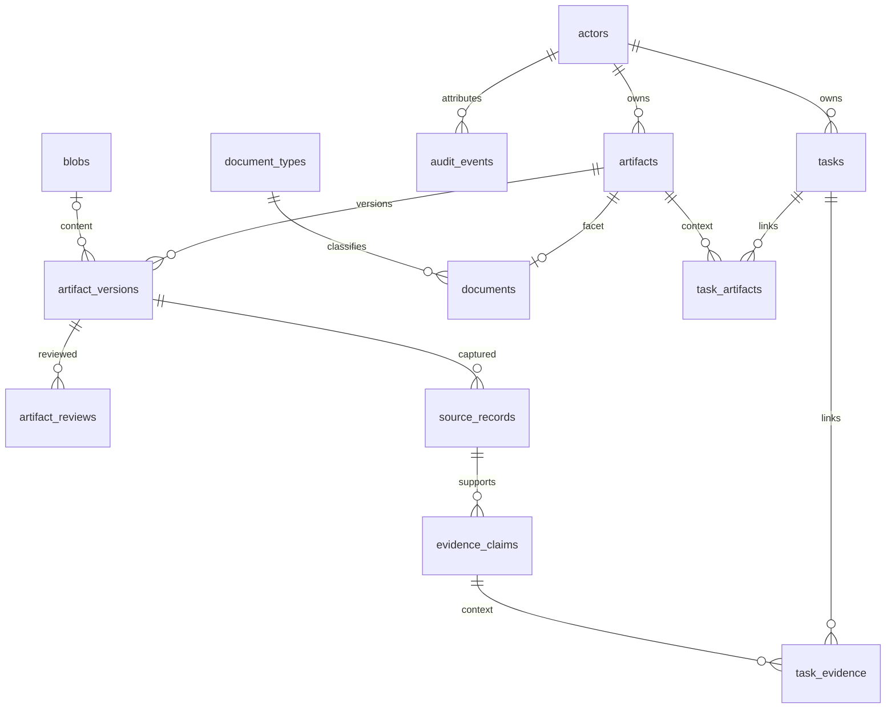
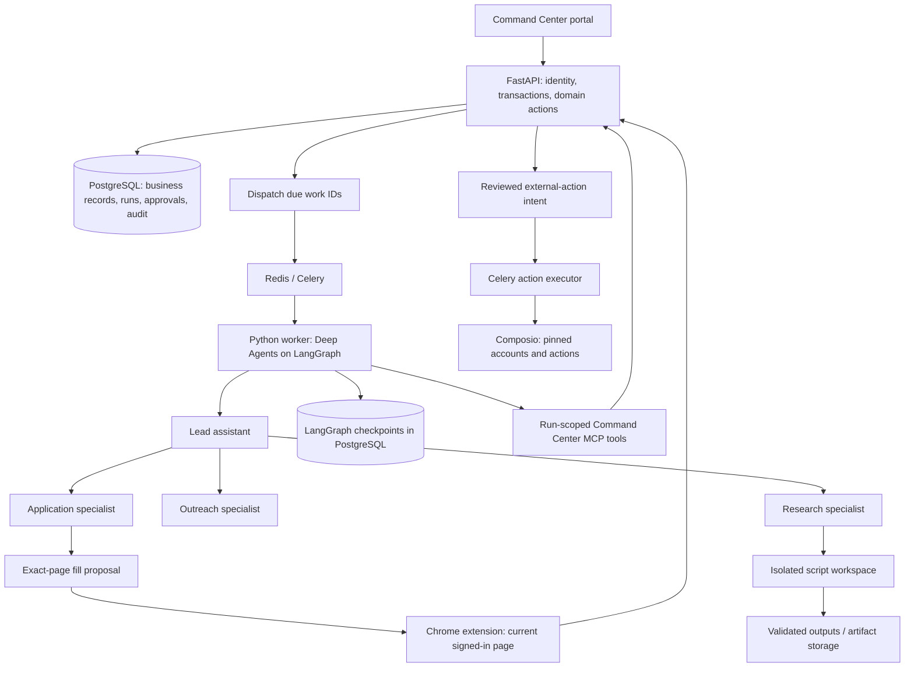
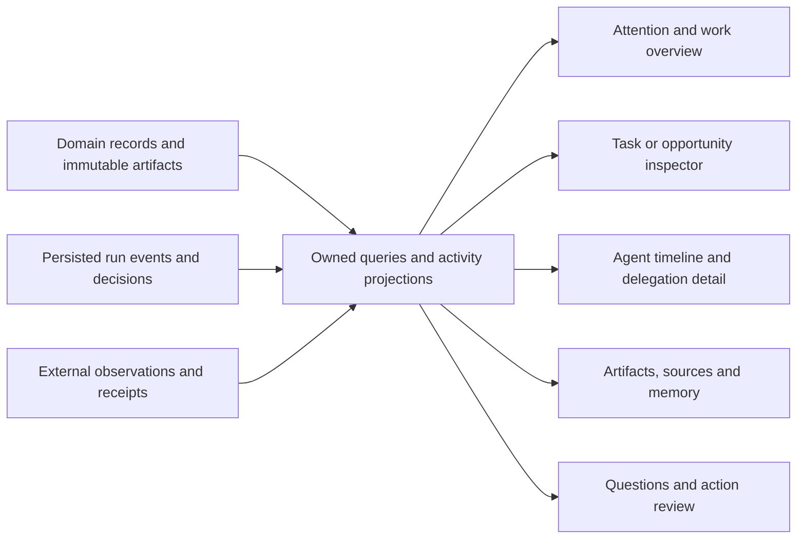

# Command Center — Tech Spec

**Revision:** 2026-09-22-r30. **Status:** connected workspace, Deep Agents conversations, reviewed facts/memory, application assistance, reviewed connected actions, isolated research/PDF jobs and spending/recovery controls implemented locally. The personal work OS revamp is in progress. Shared email drafting and explicit human-only email pulls are implemented locally; dedicated Notes/Library, original/extraction reading, content search and linked tasks are implemented locally. Deep Agents supports OpenAI, Gemini, Mistral and Cohere per profile. Hands-on platform/provider QA is deferred to the user; unattended campaigns remain later scope.

This is the single technical source, absorbing the former Planning Doc's architecture, the additional Notion technical section, agent plan and reference learnings. [Product Spec](../product/product-spec.md) owns behavior and release acceptance. [engineering.md](engineering.md) owns build sequence, file/test contracts and delivery evidence. [Design Spec](../design/design-spec.md) owns the interface. Historical copies are not competing specifications.

## One-click application companion — 2026-09-22

The MV3 companion opens a persistent Chrome side panel. Autofill retains snapshot/preparation/authorization/command identities before I/O, resumes unfinished requests and stores the command result before reporting it. Claim precedes all page I/O. Unknown execution never replays; a lost result acknowledgement retries only reporting. Manual edits are frozen during an operation; subsequent reviewed fills recapture the page and require an identical control structure, preserving newly present values.

`ApplicationPreparation.autofill` re-derives only active, unexpired approved facts and the pinned résumé. It records an accurate explicit autofill approval rather than asserting a per-field review occurred. Résumé and cover-letter selections match distinct, compatible empty controls, with at most ten uploads total. Cover-letter labels must explicitly identify a cover/covering letter and cannot also name résumés or other supporting material. Ambiguous fields and replacements remain explicit review choices. Scalar dropdowns match a unique exact displayed option label. Sensitive questions require their existing scoped answer contracts. Schema `0023_application_profile` adds explicit identity/address/GitHub facts and permits multiple immutable preparations under one task. Continuation requires the same owner, paired device, page URL and active task. Downgrade refuses to lose new facts or continued preparation history.

`scripts/companion_bridge.py` is a native-messaging host restricted to the extension's stable public-key-derived ID. `make companion-browser` installs the local helper and opens a dedicated persistent profile with the extension. It invokes `ab clean` under one project/task session. The only request is inspect(url, nonce); AgentBrowser selects an exact matching tab and runs the fixed bounded `page-structure.js` reader only if the DOM marker matches. No arbitrary command/JS input, HTTP listener or cookie export is exposed. Input values/password controls are excluded; page data is not agent instructions. The native content script still binds controls and verifies/applies changes. Control inspection metadata stays local in the companion; a recognized job description is saved with the application source. The native host removes inherited AgentBrowser daemon environment variables and disconnects native stdin from subprocesses. macOS/Linux setup is implemented; Windows packaging is not.

## 1. Architecture direction

### Application tracking — implemented contract

`0024_application_tracking` adds an owner-bound `ApplicationTrack` facet keyed by the existing preparation task. Creation is transactional with the first preparation; continuation reuses the facet. Migration backfills preparing regardless of task completion and refuses downgrade when reported outcomes would be lost. Status changes require the human owner, an expected row revision and an idempotency receipt; audit records previous/new status and `human_report` provenance. `submission_recorded_at` is the time of the user's report, not an observed portal confirmation. Task state and opportunity stage remain independent.

The bounded Applications API lists metadata, pages through capture packages and reads an exact immutable package version. Package history projects résumé metadata and the latest fill receipt without loading every answer body or command payload. Résumé links resolve to the owned selected original or completed PDF artifact/version. Browser snapshot/detail and latest-preparation reads reopen captures outside the recent twenty-item window. The extension compares locally retained full URLs, including query strings, before automatic continuation or reviewed recapture; query strings are not copied into server snapshots. This does not yet resolve the same job across different pages or portal identities.

### Application job context — implemented contract

Schema `0025_application_context` adds an optional owner-bound source artifact link to `ApplicationTrack`. Preparation creation can attach the first bounded job description; subsequent captures preserve it. Manual creation starts with a saved empty version so the existing durable writer has a stable identity before typing. Source metadata and immutable text share one artifact lifecycle; edits preserve the original capture metadata. Human creation uses row revisions, receipts and audit. Archived sources must be restored rather than silently replaced. Downgrade refuses to discard populated links.

The native fixed reader parses inert JobPosting JSON-LD or an unambiguous supported description container, excludes scripts/forms/editable surfaces, caps text at 30,000 characters and reports truncation. No whole-page fallback is used. The stored source URL comes from the owned capture. `application_context` exposes the current saved source version; the application agent pages through its text with `document_read`. Requirements do not approve candidate facts or supply new execution authority.

### Application materials — implemented contract

Schema `0026_application_materials` adds an owner-bound request under the existing application Task, with one assigned agent run and an optional immutable output. Creation pins the saved job version, selected résumé file version, completed extraction or PDF source text, and active global approved fact revision IDs. Contextual answers are excluded. Task/conversation locks reject competing active work; request receipts recover ambiguous replies. Material history is paginated metadata, not duplicated document bodies. Downgrade refuses to delete request/source history.

`application_material_context` pages through pinned facts that remain active and exposes exact source IDs for `document_read`. `save_application_material` is restricted to the assigned run and current lease, revalidates cited facts and source ownership/availability, and creates one typed document with source derivations and a TaskArtifact link. The application Task and reported status stay unchanged. Model grounding instructions and fact citations do not establish paid-model quality.

Generated documents use the existing Tiptap working-copy/checkpoint lifecycle and PDF export pipeline. Browser résumé selection accepts only owned, active typed originals or completed PDF-export outputs, with exact blob metadata retained through command review, claim and application. An arbitrary blob bearing a résumé type is insufficient. The same typed resolver serves separate cover-letter lists and explicit selection. Immutable preparation payloads carry an optional cover-letter version, metadata and upload-field list alongside the résumé fields. Review validates a disjoint set of at most ten file targets; proposal and claim recheck each field against its exact typed file choice and availability. Legacy payloads default to no letter. Request canonicalization omits empty new options so pre-update receipts retain their hashes. No new migration or content-script protocol version is required. Package history reads metadata for both selected documents.

### Application keyword coverage — isolated branch, verified

This contract is implemented in isolated `application-keywords`; it is not deployed to the user's stable `frontend-redesign` smoke-test build at `2ad39e7` with extension `0.4.3`. Non-browser validation is complete; Engineering records the evidence. Browser QA remains skipped at the user's request.

`POST /api/v1/applications/{task_id}/keyword-match` is a human-only, owner-bound read. It requires the exact current saved `job_version_id` and a selected `resume_version_id`; a stale job version must be reloaded. The existing résumé resolver accepts owned, available typed originals or completed PDF exports and resolves their exact completed extraction or export-source text. Empty or unavailable sources are rejected. The response returns job, résumé file and readable text artifact/version metadata, captured-job truncation and the analysis. It creates no saved analysis, artifacts, facts, task/status changes or agent work and calls no model or provider. No migration or companion update is required.

`keyword-coverage.v1` uses literal whole-token matching with Unicode NFKC, whitespace/case normalization and explicit spelling aliases. Punctuation-sensitive names remain distinct; there is no stemming or inferred qualification. Autodetection keeps at most 50 curated skills/role phrases in job-occurrence order and reports truncation. Optional selected keywords replace detection: 1–50 nonblank terms, each at most 80 characters before and after cleaning, with normalized/alias duplicates counted once and the first chosen label retained. Selected terms may be absent from the job. Both source texts are limited to 200,000 characters before and after normalization; oversized input is rejected. Score is matched unique terms divided by checked unique terms, expressed as an integer percentage rounded half up. No detected terms yields a null score. This is text coverage, not ATS ranking or eligibility.

### Multi-page application continuation — implemented contract

`PreparationCreate.continue_on_new_page` defaults to false and requires a previous preparation when true. An explicit choice can continue a new page, including another origin, while owner, paired device, opportunity and active-task checks still apply. Every new page receives its own immutable answer package under the same canonical task; existing job context is retained. Packages and audit retain the previous preparation and whether this was a same-page capture or a confirmed page. History selects this metadata without loading answer bodies. Omitted/false confirmation remains absent from receipt hashing so older retries still work.

The companion compares complete URLs locally, including query parameters. Exact-page repeats retain automatic continuation. A changed URL enters a durable choice stage before API preparation or filling. The captured tab/full URL, previous application reference, selected files and confirmed choice remain frozen through reopening and response loss. Different jobs never merge solely because they share a hostname/path. Full query strings remain local. This is explicit continuation; automatic ATS identity detection and portal reconciliation are still open. Next/Submit remain manual. No SQL migration or permission changes are required; companion version is 0.4.3.

### Structured career facts — implemented contract

Employment and education reuse `ProfileFact` and immutable `ProfileFactRevision.value` with a validated `career.v1` JSON encoding. No second profile store or SQL migration is needed. Typed entries require the matching fact kind and global context; source versions/excerpts remain separate pinned evidence. Validation rejects unknown fields, mismatched education/employment components, invalid calendar dates, proven reversed date intervals and a current entry with an end date. Partial ISO dates retain year/month/day precision. Existing prose remains readable. API reads add typed career data and optional suggestions for unambiguous legacy LinkedIn mappings.

Future imports derive stable fact IDs from the original source value before encoding. Re-import cannot change an existing proposal or approval. Unknown dates, ambiguous legacy headings or oversize entries keep their existing source/plain-text handling. The profile editor mounts working-draft persistence only while open, retains its original row/source revisions, uses the same receipt after a lost reply and preserves newer typing after checkpoint recovery. A newer fact requires an explicit editing-base choice.

Browser captures add optional career-group metadata: kind, ordinal, heading, component and order. Automatic answers select one approved global career revision for each existing explicit group. Multiple entries require unambiguous start-date order; duplicate components or incompatible group metadata require manual review. A prefilled group is preserved as a unit, and local node/order/value guards stop changed groups from mixing entries. Exact fact evidence remains pinned through proposal and claim, including revocation checks. Absent new metadata is omitted when storing older capture formats to preserve retry identity.

Native date/month controls use validated calendar ranges and exact step checks. Split year/month controls and declared text formats use only known source precision; no missing month/day or current status is inferred. Unknown group components never fall back to unrelated scalar profile facts. Companion 0.4.2 changes no permissions or SQL schema. Automatic row creation, broader ATS compatibility and automatic job identity detection remain separate work.

### Selected stack and implemented boundaries

The implemented stack is FastAPI, SQLAlchemy/Alembic, PostgreSQL 17 in Compose, Next.js/React/TypeScript, Clerk, Deep Agents on LangGraph with native OpenAI/Gemini/Mistral/Cohere adapters, Celery/Redis and an initial Composio integration. Deep Agents 0.7.16 and the supported PostgreSQL checkpointer replace the custom reason/tool loop. Exact installed dependencies live in `apps/api/uv.lock` and `apps/web/package-lock.json`. Reuse the existing Docker Firecrawl/SearXNG/Docling services. PostgreSQL supersedes the historical SQLite/FTS5 proposal; Comp AI remains a reference, not a fork.

Use `apps/api/` for routes, settings, expressive SQLAlchemy models, provider adapters and agents; `apps/web/` for the portal; `apps/extension/` for the host browser companion. Model methods own validation, state changes and audit without committing their caller's transaction. Controllers own authentication, HTTP parsing, transactions and responses. Keep network I/O in clients outside domain transactions. Use direct ORM operations rather than generic repository/service layers. Next.js is not a second domain backend.

The implemented shadcn workspace exposes actor-owned CRM, profile, tasks, artifacts/versions/reviews and audit. Clerk session JWTs are verified against the configured issuer/JWKS and authorized origins. The browser calls a same-origin Next.js forwarding route with the verified session token. User-provided actor IDs never grant access; reads and foreign references are actor-scoped. Root `.env` owns provider secrets; the generated, allowlisted `apps/web/.env.local` contains only web settings, outside client bundles, prompts and memory. The diagnostic bearer credential is separate from human Clerk identity and signs scoped internal run capabilities.

Receipt-backed mutations persist an actor-scoped request hash/result with the model change and reject reuse of an Idempotency-Key with different input. New row UUIDs derive from actor, resource and key. Mutable records use optimistic revisions and reject stale edits. The accepted frontend work to preserve those keys, drafts and identity boundaries is tracked in [engineering.md](engineering.md#accepted-workspace-hardening); server guarantees do not establish correct client retry behavior. Provider connection initiation has no equivalent local receipt guarantee.

Alembic owns one schema history. Separate runtime/migration URLs and session/transaction pool settings support a later Supabase deployment while retaining FastAPI as the access boundary. Application tables have RLS with no public Data API policies. Local PostgreSQL/blob backup restoration has been verified in isolated temporary resources; Supabase deployment has not been performed. Root [README](../../README.md) owns setup and migration commands.

### Implemented agent and browser slice

Document imports preserve original PDF/DOCX/text/Markdown bytes in private content-addressed storage and append immutable artifact versions. Migration `0006_documents` adds a leased conversion job and an exact default-resume version reference. The Celery worker submits bytes to local Docling, bounds conversion time/results and creates an immutable derived artifact containing text, structured document data and producer version. Duplicate delivery, cancellation and lease expiry cannot publish another output. Every import records acquisition and an open review task. Original downloads require owned artifact/version IDs. A new original never silently replaces the selected default resume.

Migration `0007_profile_facts` adds immutable candidate-fact revisions and human reviews with current-proposal and active-approved pointers. Agent proposals require an owned textual source version and verbatim excerpt. Pending edits/rejections preserve the active approved revision; revocation clears it without fallback. Scalar approval conflicts require explicit resolution; contextual answers retain their question context and expiry. Agents read bounded exact document passages, propose facts and retrieve only active unexpired approvals through scoped tools. They cannot approve facts or select the default resume. The Settings review UI and extraction task Conversation expose these operations.

Job-lead discovery reuses public search and saves actor-deduplicated company/job/opportunity records plus immutable capture evidence. Opportunity research appends new source acquisitions without overwriting CRM facts; `SourceRecord.opportunity_id` and its immutable trigger are introduced by migration `0005_job_leads`. Public enrichment uses a direct HTTP adapter with connection-pinned public DNS, validated redirects, raw response/time limits and no provider credentials; it records `public_http/html_text` provenance. Firecrawl cannot supply caller-enforceable network limits through its current scrape contract, so arbitrary agent URLs do not pass through that service. The controller releases its read transaction during the fetch and then locks/rechecks the original agent lease and source target before a receipt-backed write. The web Research tab and scoped MCP tools expose capture, enrichment, exact source versions and outreach drafting through the existing conversation/artifact lifecycle. These are drafts; reviewed sending, richer extraction and campaign policy remain separate work.

Task/opportunity conversations persist ordered messages, one active root run, received/consumed instruction sequences and completed replies. Lead/research/application/outreach roles use pinned configuration and role-scoped tools with shared model/tool/concurrency/time budgets. Instructions arriving during work are read before further model/tool steps; stale planned tool calls are skipped. The worker renews its lease independently of model I/O and persists supported LangGraph checkpoints in a separate PostgreSQL schema. Checkpoints do not authorize automatic replay of interrupted work. The web Conversation tab shows saved specialist/tool activity and opens the exact immutable artifact version produced by a run. Migration `0004_conversations` and deterministic mocked-provider regressions cover these contracts; live paid-model quality remains unverified.

Migration `0016_agent_questions` adds durable questions and answer/resume intents. The local `ask_user` tool pauses through native LangGraph interrupts; only committed saver interrupt/task identities become owned questions. Waiting releases the worker lease. Human answers require the exact question revision and an idempotency key, then resume the same graph branch through a durable intent. Saver/ledger crash reconciliation fences stale leases; answering one question does not authorize another branch. Conversation UI retains unfinished answers during refresh and resume. Generic agent drafts may bind owned source-version IDs through immutable `ArtifactDerivation` records with method `agent.draft`; subsequent source or output edits do not retarget that lineage.

Celery/Redis handles dispatch while `agent_runs` is the authoritative PostgreSQL ledger. Atomic claims, leases and fenced checkpoints reject duplicate deliveries and stale completion. Interrupted runs fail explicitly rather than silently repeating paid or external work. Deep Agents runs bounded lead/specialist graphs with independently selected OpenAI, Gemini, Mistral or Cohere models. Profiles pin provider/model selection; readiness checks include delegated profiles and missing keys never cause provider fallback. `agents/profiles.toml`, executive directives in `agents/directives/` and Markdown skills are snapshotted by revision. Coding-assistant `AGENTS.md` is never loaded into runtime prompts. Agent tools discover through the internal authenticated Streamable HTTP `/mcp/` endpoint using `langchain-mcp-adapters`; discovery is scoped to the run's saved grants. The MCP server uses a separately scoped API token for existing FastAPI endpoints. Tokens are short lived, require a live lease and never enter model messages. Composio schemas/actions are explicitly allowlisted and version pinned; account connection uses the actor UUID.

Migration `0011_reviewed_memory` adds immutable note revisions and exact human reviews, with separate current-proposal and active-approved pointers. Legacy human notes retain their intentional-save provenance; legacy agent notes become proposals. Agents retrieve only approved, unexpired global and server-derived task/opportunity notes through bounded PostgreSQL full-text queries. Pending changes preserve the active note; revocation and archive remove it from retrieval. Memory is not a fact-verification or authorization system.

Browser protocol v2 (`0008_browser_assistance`) captures control-aware empty/present state without existing values or cookies. Commands bind the owner, paired device, exact page, selected fields, explicit replacements and immutable resume bytes. Local checks preserve values changed after capture, validate uploads by size/hash and report per-field outcomes. Migration `0009_application_preparations` links the page to a task and immutable `application.answers.v1` artifact versions. Generation proposes cited answers through scoped tools; human revision explicitly reviews every retained answer and selected upload. Proposal and claim recheck approval, current evidence and resume availability. Synthetic control-pattern fixtures cover native text/select/radio/checkbox/file and dynamic/unsupported cases; they do not establish full Greenhouse, Lever, Ashby, Workday or iCIMS tenant coverage. Next/Submit and later campaigns retain their separate Product Spec boundaries.

Migration `0010_agent_events` persists ordered, owner/lease-fenced public text deltas, tool activity, usage and lifecycle events. Async SSE replays from a sequence cursor without holding idle database transactions; the authenticated web proxy forwards the stream without buffering. Browser hooks deduplicate reconnects and batch rendering independently per run. Private reasoning and framework checkpoint internals are not frontend event payloads.

Companion 0.3 extends protocol v2 without new browser permissions or database tables. It captures visible same-origin frame controls while retaining exact Document/frame/full-URL references locally; replaced or navigated frames invalidate the command. Native radio/checkbox actions reach React state. Known single-select widgets share at most 300 exact choices, revalidate them before any write and confirm canonical selected state. Numeric constraints travel with the existing snapshot JSON; fat-model validation uses the native finite-number grammar and exact Decimal bounds/steps. Search-dependent or ambiguous widgets remain manual. Hands-on ATS/provider QA is deferred to the user.

Vercel AI Elements supplies generated Markdown, conversation and tool-result components over the existing API. Eve was evaluated on 2026-09-21; it would be a separate TypeScript durable-session runtime, so it is not installed alongside the selected LangGraph/Celery stack. The UI design review is recorded in `docs/design/design-spec.md`.

### Reviewed workflow implementation

Migration `0012_reviewed_actions` adds verified external account references, immutable action revisions/attachments/reviews, execution attempts and durable connected-request claims. Model methods own transitions, scope, review and audit. HTTP controllers claim and commit before provider I/O, then recheck owner/run lease and finalize in a fresh transaction. Typed Composio adapters pin toolkit versions, preserve provider log IDs, disable SDK retries and distinguish failed, partial, conflicted and unknown outcomes. Conditional remote updates remain a disclosed provider limitation; uncertain writes are never automatically replayed.

Migration `0015_connected_context` adds Calendar-window observations. `POST /api/v1/integrations/composio/context` and the scoped `connected_context` agent tool accept an owned account and a discriminated Calendar-window/event, Linear-issue or Notion-page query. Domain models validate account/toolkit compatibility and bounded aware time windows, and capture immutable observations with audit. Each provider operation has its own spending reservation; network work follows a committed request claim and precedes a fresh, lease-fenced finalization transaction. Fresh account identity and local account state are rechecked. Context is bounded to 12,000 encoded bytes, with explicit truncation/digests; a locally shortened event page cannot expose a continuation token that skips omitted events. Malformed provider success payloads fail visibly. The migration refuses downgrade when Calendar-window observations exist, preserving provenance.

Migration `0013_research_documents` records script/input/output lineage and separate PDF jobs in the existing immutable artifact lifecycle. Injected Docker script/renderer adapters perform bounded execution outside SQL transactions. Trusted workers hold leases; generated containers receive only selected input bytes and fixed policies, with no network, credentials, host mounts or socket. Cited outputs remain editable documents; PDFs are exact-source derivatives. The execution queue reaps only the abandoned job's persisted container lease and requires proof of cleanup before explicit retry.

Migration `0014_spending_controls` adds immutable USD rate cards, monthly UTC periods, server-derived work budgets and idempotent reservations. Each actual model call, including specialists and internal summarization, reserves a conservative input/output bound before dispatch. Connected calls reserve exact configured operation rates. Concurrent reservations lock the shared owner/work budgets. Definitive usage settles once; unknown usage retains the bound, with fenced late settlement supported. Numeric budgets/prices remain human configuration, and hidden model/provider retries are disabled. The Settings catalog exposes required operation/model identifiers without inventing prices.

Compose dedicates capacity to agent conversations, integrations/document extraction and isolated execution. PostgreSQL remains authoritative through broker outage/redelivery. Vercel AI Elements consumes durable per-run token/tool events; reconnects only replay event delivery. Reviewed actions and spending controls use generated HTTP contracts and ordinary shadcn forms. No generic repository layer or second runtime was introduced.

### Workspace navigation boundary

Top-level sidebar links perform normal Next.js route navigation and render the selected section across the main workspace; `/` is only Overview. Body record links/actions use the existing `record` selection, bounded `inspect` stack or modal editors when appropriate. Preserve the page path and context for inspection; a sidebar route change opens its destination without carrying the old inspector. Modified clicks and direct URLs remain standard links. [Design Spec](../design/design-spec.md#navigation-and-context-contract) owns visible behavior and accessibility acceptance.

### Current data flow

```text
Clerk session -> Next.js forwarding route -> FastAPI models -> PostgreSQL
                                                |             records, versions,
                                                |             audit, run ledger
                                                v
                                        Redis / Celery dispatch
                                                |
                                                v
                                        trusted LangGraph worker
                                          |              |
                                          v              v
                                  run-scoped MCP    model providers
                                          |        / provider clients
                                          v
                                       FastAPI

Host extension <-> paired browser API -> snapshot / fill proposal / outcome
       |
       +-> explicit Apply on the exact shared form (no upload or submission)

Operator importer -> validated actor + supported local source files
                  -> PostgreSQL transaction -> rollback preview or --apply
```

The trusted worker owns ledger/storage access. Model-discovered tools receive narrow capabilities, not SQL credentials. Long agent work runs outside request handlers; provider calls stay outside domain transactions. Connector status is diagnostic and never enables a campaign. Artifact versions store structured payloads in PostgreSQL or reference original document bytes in the private shared blob volume. Document upload is bounded to supported formats and size; it never accepts arbitrary filesystem paths.

Browser sessions remain on the host. The companion receives exact-snapshot fill proposals and cannot expand its authority. Application packages and autonomous execution are later contracts. Do not mount the Docker socket, full home directory or browser-profile store into the API container. Current Compose ports remain locally bound. AR-12 selects an always-on backend as the next operating target; hosting, TLS, ingress and operational setup are still to be designed rather than achieved by exposing development ports.

## 2. Domain model and boundaries

Use typed operational records plus a shared work-product lifecycle. Avoid both a resume/outreach-specific parallel store and a single unstructured database for all entities. The backend scaffold adopts documents as artifact facets under the user's instruction to fix the data model first. This is an implementation choice within the authorized scaffold, not a claimed interview answer about later product policy.

### Implemented model

The migration history currently has 25 tables: `0001_foundation` creates 14 foundation tables; `0002_workspace` adds companies, contacts, jobs, opportunities, candidate_profiles, request_receipts, browser_devices, browser_snapshots, browser_commands and agent_runs; `0003_memory` adds memory_items. Migrations and model declarations are the schema authority. The larger target-domain table below includes extensions that do not yet exist.

- Actors represent authenticated principals independently of future candidate profiles. The development bearer token currently protects diagnostics only; it does not impersonate an arbitrary actor.
- Artifacts own identity, kind, title, ownership and sensitivity. Versions own immutable content. There is no mutable `current_version_id`; versions are ordered by a unique `(artifact_id, version)`. The append API locks the artifact and checks its expected revision before creating a version.
- A version has exactly one content source: a blob reference or structured JSON with a schema key. The current text API validates bounded text and `ArtifactVersion.from_payload` hashes canonical JSON. Blob-backed versions must match the blob digest and use content-addressed keys. Blob metadata is implemented; byte upload/storage and additional schema validators are not.
- A document uses the artifact's primary key and one document type. Composite foreign keys prevent adding a document facet to another artifact kind. A deferred constraint requires every document artifact to have its facet by transaction commit. Document types such as resume/cover letter are records, not separate lifecycle tables.
- Reviews attach only to immutable version IDs. Unreviewed means no applicable review; new versions inherit none. Review/revocation events are append-only. Derivations connect exact input/output versions; graph-cycle checks belong in the future write operation.
- Sources record acquisition occurrences even when bytes are reused. Claims retain source/span and confidence, which is distinct from human approval or a candidate fact. Tasks link through real foreign keys to artifacts and claims.
- Tasks retain human/business state separately from future machine leases. Date-only deadlines and UTC instants are mutually exclusive; `done` requires a completion instant. `Task.complete` and `Task.reopen` validate transitions and enqueue redacted audit events in the caller's transaction. ORM row versions reject stale task/artifact writes.
- PostgreSQL triggers reject updates/deletes to blob metadata, artifact versions, reviews, derivations and audit events. This protects ordinary application operations, not against the database administrator. A retention operation will need an explicit reviewed contract; it must not disable triggers casually.



### FastAPI contract in this slice

`GET /health/live` answers process liveness. `GET /health/ready` returns 503 until PostgreSQL is reachable at the expected Alembic revision. `GET /api/v1/system/status` requires a bearer token and reports schema readiness plus provider reachability, with independent upstream timeout/failure states. `/docs` and `/openapi.json` describe these typed contracts. Health checks do not search or scrape. Workspace controllers expose actor-owned CRM, tasks, profile, artifacts/versions/reviews, memory, browser devices/snapshots/commands and agent run APIs. Controllers establish actor identity, validate request schemas and concurrency/idempotency headers, call model behavior within `Session.begin()`, and return typed responses. Research search uses the configured SearXNG adapter; there is no arbitrary URL-fetch endpoint. Network work must be scheduled outside that transaction.

### Target domain extensions

This table describes the target model, not a list of migrated tables. Existing CRM/profile records provide a starting point; facts, identifier/relationship histories, campaigns and applications still require their own accepted slice contracts.

| Group / record | Responsibility and principal fields |
| --- | --- |
| actors | Human/agent/service identity, external auth subject, active state; actor is distinct from candidate |
| candidate_profiles / candidate_facts | Applicant identity; versioned fact/answer values, evidence, sensitivity, validity, approval/revocation |
| contacts / contact_identifiers | Canonical person; multiple normalized identifiers, provider namespaces and source observations |
| companies / company_identifiers | Employer/agency/client organization; domains/platform IDs are evidence, not automatic identity proof |
| employments / contact_roles | Time-bounded employer/title observations and recruiter/referrer/manager/peer roles |
| relationship_evidence / contact_preferences | Dated reply/referral/shared-history evidence; channel-specific do-not-contact and preferences |
| interactions / participants | Communication/meeting event, channel, direction, time, external identity, source and multiple participants |
| jobs | Company, role title/location/family, canonical source and external ID, observed status |
| job_descriptions / job_observations | Immutable description document references and dated availability observations; failed fetch is not closure |
| opportunities / opportunity_contacts | Candidate pursuit, company/job, stage, owner, next task and multiple contact paths |
| applications / application_attempts | Candidate/job aggregate, exact package, attempt/outcome, confirmation, submitted time and later hiring state |
| application_answers / package_items | Versioned answers and exact resume/cover-letter/answer/fact references in an immutable package manifest |
| company_profiles | Versioned company/product/story research with evidence and observation time |
| interview_processes / interview_questions | Role/company-scoped reports, stages/questions, source, anecdotal/confirmation state and freshness |
| artifacts | Stable identity of a captured/created work product; kind, title, owner/creator, sensitivity, archive state |
| artifact_versions / blobs | Immutable content or validated structured payload; version, hash, media type, safe storage key, schema and derivation metadata |
| documents / document_types | Document facet and purpose/type such as resume, research, cover letter, interview brief or product plan |
| artifact_reviews / derivations | Version-specific review/revocation and input/output provenance; new versions do not inherit approval automatically |
| source_records / evidence_claims | Acquisition occurrence, source locator/span, provider/account, observed/retrieved time, extraction method and uncertainty |
| tasks | Human/business commitment: owner, title/type, state, due date/time, priority, rationale, completion and typed links |
| work_items / work_attempts | Machine execution: operation key, due time, lease owner/token/expiry, attempts, progress, retry/cancellation and error |
| authorizations / automation_runs / events | Action/campaign scope, actor/delegator, policy/material versions, expiry/revocation, run fencing and sequence-numbered outcomes |
| provider_accounts / checkpoints / enrichment_records | Credential references, selected filters, account-scoped external identity, sync progress, sourced suggestions and usage |
| audit_events | Attributed action/decision, subject/version, request/run ID, reason and redacted change summary |

`company_roles` should preferably be a view over jobs/observations rather than a second authoritative role table. `outreach_drafts` becomes a message artifact; `resume_versions` becomes typed documents with shared versions; raw sources use the same storage lifecycle plus acquisition metadata. Tasks and audit remain first-class records, not generic artifact payloads.

The broader `work_items / work_attempts` vocabulary does not require a parallel queue model for the first agent release. Extend the existing `agent_runs` ledger and action-specific records first; justify a separate generic execution abstraction only if concrete later work cannot fit those contracts.

### Constraints to encode

- UUID identity; real foreign keys; explicit constrained kinds/states; UTC instants with IANA timezone/date-only semantics where required.
- Mutable records carry optimistic row versions. Imported/model results cannot silently overwrite a later user edit.
- Version content is immutable; exact package hashes and source/fact/material versions are retained for execution and history.
- Unique application aggregate per candidate and resolved job. A reapplication is a reviewed new attempt, not a new resume bypassing duplicate checks.
- Provider IDs are scoped by source/account. Identifier conflicts and shared/recycled addresses require review.
- Typed links connect tasks/artifacts/evidence to live records. Historical audit references may retain a subject ID after permitted deletion.
- Protected values are not indiscriminately copied to audit diffs, full-text indexes, logs or exports.

## 3. Evidence, identity and imports

### Implemented operator import

`scripts/import_workspace.py` imports supported LinkedIn CSVs and cached Notion lead pages into an existing authenticated actor's workspace. It preserves source snapshots, records identity conflicts/incomplete rows and supports repeat imports. It takes an owner-scoped transaction lock, validates and flushes, then rolls back by default or commits with `--apply`; the private report is written afterward. This is a local operator workflow, not live Notion sync, resumable batch promotion or a portal import review UI. Usage is in [README](../../README.md#checks-and-migrations); synthetic coverage is in `apps/api/tests/test_workspace_import.py`.

The D4 mapping uses an explicit contacts/professional-profile file and column allowlist. A positional manifest accounts for excluded and duplicate headers without reading excluded bodies. `contact_observations` stores all seven connection fields with the exact owned source version, source row and mapping revision, independently of editable CRM values; it is immutable and owner constrained. Source identity survives folder moves. Existing contact edits, archived records and reviewed facts are preserved on replay. Career fields become pending `ProfileFact` proposals; certification, project, course, language, publication and recommendation are typed fields alongside existing experience/education/skill fields. Attributed endorsements remain source evidence. Partial dates stay verbatim, missing end dates stay unknown, and oversized entries remain source-only with an issue in the report. Migration `0017_linkedin_mapping` refuses downgrade while this evidence exists. Settings pages through all fact proposals, and contact details link to their pinned export evidence.

### Target evidence and ingestion contract

Model the chain as acquisition/content → extracted assertion → evidence-backed interpretation → decision/material/action → audit. A “fact” table name or hash does not make an assertion true. Keep source confidence, extraction uncertainty, human approval and recency separate. Re-fetching identical content can reuse bytes while recording a new observation.

Every consequential score, tailored personal claim, eligibility answer and action rationale needs appropriate evidence. Candidate personal facts require an explicit provenance/approval contract. A company-level sponsorship history cannot automatically answer a job- or person-specific question. User corrections and revoked evidence must affect future packages while preserving historical submissions.

Matching one unambiguous strong identifier attaches observations to a canonical record. It does not silently merge two existing people. Names, similar titles, shared domains and fuzzy matches are review suggestions. Preserve aliases and original values. Do not globally strip email dots/plus suffixes. Job identity prefers a stable employer/source job ID; URL normalization must preserve role-defining parameters. Similarity-based job matches are candidates, not definitive duplicates.

The initial sources include LinkedIn CSV and reviewed Notion seed records. Retain original source locator/row, mapping/parser revision, unknown columns and per-record disposition. Full ZIP inspection later adds safe member inventory, supported-schema discovery and bounded extraction. A replay key combines source identity/content, parser/mapping revision and record locator.

Import outcomes are mutually exclusive per logical record: created, updated, unchanged, skipped, quarantined or errored. Report entity totals separately because one row may produce several records. Physical lines are not CSV records. Promotion checks the reviewed staging revision, commits bounded batches with durable progress, and resumes idempotently. Undo is a compensating repair, not a promise to erase later user edits. Google sync later requires account-scoped checkpoints, deletion/cancellation handling, filter changes and expired-checkpoint resynchronization that preserves local manual data.

## 4. States and API/tool contracts

The table below includes future workflow vocabulary; implemented CRM, task, run and browser enums are authoritative in their models and migrations. Define each legal transition with actor, preconditions, effects, audit event, authorization and scheduling behavior before migration.

| Record | Candidate states / essential rule |
| --- | --- |
| Opportunity | researching, preparing, applied, interviewing, offer, closed; closing/reopening retains reason/history |
| Application/attempt | draft, ready, running, submitted, failed_before_submit, outcome_unknown, withdrawn/rejected/offered; unknown blocks blind resubmission |
| Artifact review | unreviewed, approved, rejected, revoked for an exact version |
| Business task | open, in_progress, snoozed, done, cancelled; worker retries do not alter its meaning |
| Machine work | queued, leased/running, retry_wait, completed, failed_terminal, cancelled, needs_review; leased completion requires current ownership |
| Authorization | proposed, active, expired, revoked, consumed, with applicable usage/reservation semantics |
| Import | uploaded, inspected, staged, awaiting_review, promoting, completed/completed_with_exceptions, failed, cancelled |

Use versioned typed APIs, bounded pagination, authenticated actor identity, request IDs, optimistic concurrency, safe error codes and asynchronous job status. Retryable mutations need request hashes/idempotency keys; reuse of a key with different input is a conflict. Domain uniqueness persists beyond request-cache expiry. Do not accept client-supplied actor IDs as authentication.

| API/tool family | Required contract |
| --- | --- |
| Search/campaign | Input type, target/filter version, sources/actions, budget/limits, status and candidate reasons |
| Leads/imports | Upload/Notion-source selection, inspect/stage/report/review/promote/cancel, counts and source links |
| Contacts/companies/jobs/opportunities | Typed record changes, canonical identity, conflict results and source observations |
| Research/capture | Bounded source policy, asynchronous status, versioned descriptions/dossiers and failures |
| Candidate facts and answers | Evidence, approved/current value, sensitivity/context, missing answer and revocation |
| Artifacts/documents | Create, append version, generate, review, compare/export; exact typed inputs and provenance |
| Applications/packages/outcomes | Candidate/job uniqueness, immutable manifest, attempt, confirmation/user-attestation level and reconciliation |
| Authorizations/runs/events/halt | Scope/material validation, atomic reservation, fenced actor, sequenced events, stop/revoke and outcome ambiguity |
| Tasks/queue/audit | Due semantics, deduplication, explanation, owner filters and redacted history |

For implemented endpoints, FastAPI routes/schemas and generated `apps/web/src/lib/api-types.ts` define the contract. The table above is a future-family checklist, not a second API reference. Later endpoint paths, schemas, indexes and files must be specified before implementing the affected slice.

## 5. Durable agents and execution authority

The implemented bounded-run contract is in section 1. The rules below extend it to future campaigns and consequential execution; they do not describe shipped submission support.

Capabilities include discovery/extraction, company research, fit/legitimacy assessment, truthful writing, criticism, browser execution and reconciliation/follow-up. They do not each require a separate process or model. Use deterministic code for parsing, state and policy, with validated structured inputs for domain actions. The new interview explicitly includes generated research scripts; their execution environment and access boundaries remain to be designed rather than inferred from model text.

The dispatcher atomically claims due work, issues a renewable ownership/fencing token, records attempts and bounded retry state, and checks ownership before committing completion. Network/model/browser calls occur outside DB transactions. Unique business-operation keys and result records prevent duplicate internal effects. Cancellation, expired ownership and stale results must be explicit.

An expired lease does not prove that a portal submit failed. Before the action, persist intent and the authorized package; afterward retain confirmation/receipt. A crash or timeout around submission enters outcome reconciliation. Neither retry nor a second worker may blindly repeat the possible external effect. Halting locally cannot retract a request already sent.

Markdown skills already live in `agents/skills/`, with run configuration and skill revisions pinned at creation. Future campaign policy and tool-schema versions must join that execution snapshot. External webpages/emails/exports cannot modify instructions, approve facts or issue permissions. The proposed campaign policy returns allow/deny/require-review plus reason codes, missing evidence and required scope.

Campaign-level authority remains a later recommendation: approve filters, candidate facts, allowed actions/sites and limits once, then permit eligible unattended work within them. Exact limits await Product Spec Q7/Q8. For the selected first release, the user reviews/clicks Next and Submit in Chrome; email sending and Calendar/Linear/Notion changes require approval in Command Center. These confirmed boundaries take precedence over earlier unattended-release assumptions. Filling known fields and generating isolated research scripts do not require a separate approval per field or script.

### Agent harness evaluation — research baseline

**Decision updated 2026-09-21: AR-15 selects Deep Agents on LangGraph.** The comparison and component inventory below are the historical pre-migration baseline. The Deep Agents runtime and persistent conversation slice are now implemented and reviewed; the broader architecture still includes future contracts. [Product Spec's agent interview](../product/product-spec.md#agent-architecture-interview--opened-2026-09-21) owns accepted behavior and remaining product decisions.

Confirmed comparison inputs: one lead assistant coordinates visible specialists. The concrete workflows are extension-activated application filling and LLM-generated responses in the user's authenticated Chrome session, with the user reviewing/clicking Next/submitting; outreach drafted and approved in Command Center before sending; and writing/running a research script to produce an interview-prep or company-research document. General computer/code execution and business workflows are equally important. Composio is the main integration priority for Gmail, Google Calendar, Linear and Notion, with Slack next. The user selected an always-on backend, isolated automatic research scripts and Deep Agents on LangGraph. Source/account scope, host/sandbox provider and detailed execution contracts remain open. The comparison considered Codex as a potential primary harness, not merely a coding specialist. The [first-release contract](../product/product-spec.md#first-agent-release--confirmed-interview-direction) distinguishes this work from later unattended application execution.

| Existing component | Inspected contract | Consequence for planning |
| --- | --- | --- |
| `agents/profiles.toml`; `apps/api/src/command_center/agents/config.py` | Research and writing profiles select models, limits, tools and revision-pinned Markdown skills | Selectable profiles exist; delegation between agents does not |
| `apps/api/src/command_center/agents/runtime.py` | Custom LangGraph reason/tool loop; bounded steps; sequential tool calls; each invocation starts fresh | No coordinator, child-run hierarchy or continuing conversation is implemented |
| `apps/api/src/command_center/db/agents.py`; `agents/worker.py`; `agents/queue.py` | PostgreSQL run ledger, atomic claim, live lease, fenced progress and Celery dispatch | Saved progress is not a resumable LangGraph checkpoint; expired work fails explicitly. Waiting for a person and resume need a new lifecycle contract |
| `agents/mcp_server.py`; `core/capabilities.py` | Live run-scoped MCP/API capabilities; tools use existing authenticated domain mutations | Existing ownership, audit and idempotent mutations are reusable foundations |
| `agents/config.py`; `agents/runtime.py`; `api/agents.py` | Composio connection initiation and explicitly configured, pinned, read-only tools keyed to actor identity | Expand and verify the existing integration. Defaults enable no Composio tools; live execution has not been established |
| `db/artifacts.py`; `db/models.py` | Immutable artifact versions, version-specific reviews and business task transitions with audit | Artifact approval is not a general permission to execute an agent action |

Paths in the table without the full prefix are relative to `apps/api/src/command_center/`. Inspected tests cover capability boundaries, duplicate delivery, lease expiry, skill snapshots and a real HTTP MCP-to-API-to-PostgreSQL worker path in `apps/api/tests/test_agent_security.py`. Model tests cover task/audit transactions and artifact immutability. Tests were inspected, not rerun for this documentation session. No Slack integration or Composio-specific tests surfaced in the targeted source/test inventory.

Additional source findings for the requested async, memory and token design:

| Inspected implementation | Migration implication |
| --- | --- |
| `db/session.py` uses sync SQLAlchemy; `main.py` owns an async research HTTP client; `agents/mcp_server.py` offloads sync handlers to a thread pool | Preserve explicit ownership of sessions/event loops; async model/tool execution does not require rewriting ordinary ORM operations |
| `agents/queue.py` already configures late acknowledgement, worker-loss rejection, prefetch one and 840/900-second soft/hard limits; `agents/worker.py` renews five-minute leases only at progress checkpoints | Retain existing queue controls, add a liveness contract for long calls and review timeout coordination; queued delivery is not execution recovery |
| `agents/mcp_client.py` eagerly discovers/binds all granted tools; `MCPTools.execute` mutates shared `call_id` and invokes `asyncio.run()` | Before concurrent async tools, use invocation-local identity and an async-safe client boundary. Add scoped catalog caching/progressive exposure where justified |
| `agents/config.py` eagerly concatenates up to ten Markdown skills; the assembled snapshot is now validated against the 20,000-character profile limit before enqueue | Progressive skill loading remains future work; oversized assembled context now fails configuration loading |
| `db/memory.py`, `api/workspace.py` and `agents/runtime.py` provide owned note CRUD; `memory_read` matches titles, newest-first, at most twenty | This is not content/semantic retrieval. Design scoped retrieval and memory-write policy explicitly rather than claiming the current feature supplies it |
| `agents/runtime.py` retains accumulated messages and slices tool JSON at 20,000 characters | Replace arbitrary truncation with bounded structured previews and retrievable artifact references; measure context relevance and missing-evidence failures |

These findings come from source inspection, not newly executed regression tests. Existing tests do not establish concurrent tool identity isolation, durable human pause/resume or in-flight external-write cancellation behavior.

Workflow-specific source inventory, inspected after the user's two examples:

```text
Implemented browser path
  Active signed-in Chrome tab
    -> extension Share this form -> description-only BrowserSnapshot
    -> user manually enters answers in the web workspace
    -> BrowserCommand -> extension review / Apply
    -> claim once -> validate document -> fill -> report outcome

Implemented writer path
  User request + optional memory + bounded workspace summary
    -> writer tool loop -> generic private draft artifact
```

- Browser reuse: `apps/extension/manifest.json`, `popup.js` and `content.js` use active-tab injection, so portal authentication remains in Chrome. Command Center pairing uses a separate revocable device credential. `db/browser.py` and `api/browser.py` already bind snapshots/commands to their owner, device and document, expire them and reject duplicate claims. The web workspace's `browser.tsx` currently supplies manually entered answers; no model generates them.
- Browser gaps: no extension-triggered agent request, agent snapshot/proposal tools or context assembly exists. Capture records supported field descriptions without current values or surrounding page/question context; select options retain values without display labels. Current supported controls are top-frame text-like inputs, textareas and single selects. Uploads, radio/checkbox controls, custom widgets, iframes and multi-page navigation need new contracts if selected. Existing filling replaces eligible values and does not verify the site's resulting state after setters/events run. These are inspected limits, not approved limits for the new agent.
- Context gaps shared by both workflows: the agent grant map in `core/capabilities.py` has no read tools for the candidate profile, detailed contacts/opportunities, prior artifact content or browser snapshots. `workspace_summary` returns counts, stage totals, a few upcoming tasks and the first 20 companies. The stored profile is basic identity/preferences rather than a structured employment/education/answer record. Existing storage alone does not make this context available to agents.
- Outreach reuse and gaps: the writer skill and immutable artifacts/reviews are available, but the generic draft tool takes title/text and currently saves `kind="research"`. The API supports message artifacts, but there is no typed email recipient/subject/body/thread/account draft contract, inbox retrieval, provider draft synchronization or send workflow. Composio expansion must be designed around the apps/actions the user selects.
- Existing browser evidence: `apps/web/tests/browser-companion.spec.ts` covers description-only capture, filling once, no submission, changed-field rejection and same-page navigation invalidation. `apps/api/tests/test_workspace.py` covers pairing, capture idempotency, invalid fields, claims, outcomes and revocation. Model-generated answers, actual installed-extension initiation across portals, and provider email behavior are not covered by these tests.

Provider research checked through Context7 and official documentation:

| Candidate / integration | Documented capability | Design question still open |
| --- | --- | --- |
| Deep Agents — selected | Native Python harness on LangGraph; named subagents with isolated context, context offload, filesystem backends and human-review interrupts. Can embed in the existing worker without managed LangSmith | Verify package compatibility, durable checkpoints, streamed delegation events and sandbox backend. Ordinary subagent reports do not automatically create permanent conversational identities |
| Custom LangGraph — considered | Existing native Python graph plus explicit persistence/subgraphs/interrupts | Would require more custom delegation/context-management behavior; retain domain control while using Deep Agents' built-ins |
| Codex app-server — considered | Separate process exposing JSON-RPC over JSONL; persisted threads, MCP, streamed events, command policies and approval/clarification requests | Python integration is feasible from its language-neutral protocol; that is not a claim of a Python SDK. It adds process/protocol integration, and some dynamic-tool/child-thread surfaces are experimental. No second production harness is currently selected |
| Composio | User-scoped tool sessions and connected-account selection; explicit account pinning is supported | Which accounts/actions are allowed, and how do session execution, revocation and receipts fit the existing capability boundary? |
| Slack (deferred by user) | Preliminary research: Socket Mode supports events and interactions without a public inbound HTTP endpoint | No current architecture or implementation work; revisit only when the user reopens Slack |

Sources: [Deep Agents overview](https://docs.langchain.com/oss/python/deepagents/overview), [LangGraph persistence](https://docs.langchain.com/oss/python/langgraph/persistence), [LangGraph execution and idempotency](https://docs.langchain.com/oss/python/langgraph/functional-api), [Codex app-server](https://learn.chatgpt.com/docs/app-server), [Codex SDK](https://learn.chatgpt.com/docs/codex-sdk), [Composio sessions and account selection](https://docs.composio.dev/kb/guide/mcp-tool-router-sessions), [Slack Socket Mode](https://docs.slack.dev/apis/events-api/using-socket-mode/). Documentation establishes available building blocks, not tested compatibility with this repository or a selected deployment.

### First agent release architecture draft

**Status: proposed technical design, grounded in confirmed AR-1–AR-15.** The user requested this detail before implementation. The harness, operating model and review boundaries are selected; proposed records, lifecycle mechanics and module contracts below are not yet an approved migration plan. Reuse the existing backend, domain models, run ledger, artifact lifecycle, MCP endpoint and companion. Avoid introducing a microservice for each specialist or a second workflow engine.



The diagram shows logical boundaries, not separate services for every box. FastAPI and its domain models remain the authority for business state. Deep Agents plans and calls tools; LangGraph restores computational state; Celery assigns runnable work to processes. Neither Redis messages nor an LLM transcript determine whether an email is authorized or sent. The authenticated application session remains in Chrome.

AR-25 selects the existing Docker stack on one always-on server for the first deployment: FastAPI, PostgreSQL, Redis and Celery remain together, alongside the web deployment and existing research-service integration. This settles the deployment shape, not a host purchase, sizing, high-availability guarantee or sandbox implementation. Backups and restore evidence, persistent artifact storage, TLS/secrets, resource limits, container updates and operator recovery remain operations-review work. Generated scripts still require their own isolation boundary; co-locating trusted services does not give scripts host or Docker-daemon access.

#### Data model and ownership

**Revamp D3, confirmed 2026-09-22:** the shared writer has an autosaved working-draft state and meaningful immutable checkpoints. Reuse the artifact/document and reviewed-action lifecycles for committed content and exact external-action snapshots. A working save cannot advance an approval or change a pinned source version. Draft persistence must bind actor, target, editing base and revision; protect against late save responses and concurrent writers; preserve recoverable content through navigation, refresh and failed requests. Periodic history and review/export/send checkpoints retain exact content, while version summaries are paginated and selected bodies are fetched on demand. Migration `0018_writing_drafts` implements the owned working copy, monotonic revision/tombstone and retained save receipt. The email composer uses this draft contract with a tab-local recovery journal and exact proposal checkpoints. Periodic history, bounded version bodies and the broader notes/document/task integrations remain implementation work.

Keep business state, conversation state, execution state and external effects distinct. Table names marked proposed are design vocabulary until the migration review; they are not present-schema claims.

**Revamp D4, confirmed 2026-09-22:** the LinkedIn mapping work covers contacts and professional profile. Historical conversation/invitation ingestion is excluded; do not add its message-body storage, indexing or background retrieval. Reuse owned CRM records, source artifacts and the reviewed profile-fact lifecycle for supported fields. Account/billing/private-identity and unrelated activity files remain outside this scope. The import manifest must account for excluded files and unknown columns without copying excluded values into source snapshots or logs. Preserve existing imported records; this decision is not a data-deletion instruction.

**Revamp D5 and scope clarification, confirmed 2026-09-22:** connected external apps are the immediate build; user-defined routines are deferred. Reuse Composio connection initiation, owned verified account records, explicit account refresh and exact outreach-account selection. Account configuration, verified identity and runtime action authority are different states and must be labelled accurately. No routine definitions, schedule/trigger contracts, occurrence models or downtime-recovery policy are selected for this slice. Existing durable queues and reviewed-action execution remain implementation foundations, not a requirement to add a user scheduler now.

| Record family | Reuse or proposed extension | Ownership and essential invariant |
| --- | --- | --- |
| Actors, CRM, jobs, opportunities, tasks | Reuse existing domain records and typed links | Every lookup/reference is actor-scoped. A task is the user's commitment; an agent retry is not a new task or task completion |
| Candidate profile and approved fact/answer revisions | Extend the basic profile; add evidence-backed fact/answer revisions | The reviewed profile is authoritative. Retain source artifact/version, validity and question context. Imported assertions stay proposals until reviewed; confirmed answers must not become context-free eligibility defaults |
| Artifacts, documents, versions, reviews, derivations, blobs | Reuse one lifecycle; add byte storage and required payload validators | Resume, company research, interview brief, script and email use typed artifacts. Documents remain facets. Approval and derivation reference exact immutable versions, never whichever version is newest |
| Agent sessions | Proposed conversation identity scoped to a task or opportunity, as selected in AR-19 | One ongoing work conversation includes lead/specialist contributions and several runs. Routing to a specialist preserves its work scope; a session is not itself a task, memory store or authorization |
| Agent runs | Extend the existing durable ledger | One root execution/continuation with request, saved profile/skill/tool configuration, checkpoint reference, budget and cancellation state. Attempts receive new leases; duplicate delivery cannot create a second owner |
| Run events and delegation projections | Proposed sequenced events; derive specialist activity from stable invocation IDs | Show which specialist ran, its input/output references and outcome. Built-in subagent calls belong to the root graph; do not enqueue every model/tool/subagent step in Celery or give projected children independent leases |
| Questions and resume requests | Implemented `AgentQuestion` and `AgentResumeIntent` records | Bind each question to owner, run, interrupt ID and revision. Accept a response once; a duplicate response cannot resume a later question or unrelated checkpoint |
| Action intents and action authorizations | Proposed domain records, separate from artifact reviews | Bind exact operation, normalized payload hash, artifact version, target/account, expected external revision and expiry. An approved draft is insufficient authority for a different recipient or event update |
| Provider connections and external references | Persist local references to Composio account IDs and approved scope | Credentials remain in the connector infrastructure. External message/task/page/event IDs are unique within provider and account, not globally |
| Browser devices, snapshots and commands | Extend existing paired-device contracts | Bind proposal to owner, device, page and field state. User Next creates a new page snapshot. Filling is not proof of submission; disconnected/stale pages require refresh |
| Memory items and proposals | Extend metadata/retrieval and review lifecycle under AR-20 | Agent-proposed reusable memory is inactive until reviewed. Retain provenance, scope, exact reviewed revision and timestamps. Memory cannot grant authority, override approved facts or mark an action completed |
| Sandbox executions and usage records | Proposed resource/usage records linked to runs | Record workspace handle, input/output artifact versions, script digest, limits, exit status and actual usage. A successful process exit is not proof of a correct research document |

Use unique constraints for `(run_id, event_sequence)`, accepted resume identities and actor-scoped business-operation keys; exact columns are part of migration design. Mutable rows keep optimistic revisions. Store large source/output bodies as artifact content, not duplicated in every run event, checkpoint and audit entry. Framework checkpoint tables use the supported PostgreSQL saver; do not recreate LangGraph's serialization format in ORM models. The application maps its session/run IDs to framework thread/checkpoint IDs without treating checkpoint JSON as business truth.

For email, use a versioned message payload containing sender account reference, recipients, subject, body, thread/reply reference and attachments. Calendar, Linear and Notion changes have typed action payloads and target references. Content edits after review produce a new intent/version and need fresh approval. For updates, revalidate the external target or fail visibly on a conflict; approval does not permit silently replacing later human edits.

AR-22 selects the existing general portfolio resume as the initial default upload, with specialized variants chosen explicitly. At ingestion, persist the bytes through the shared blob/artifact/document lifecycle and bind the default to an immutable artifact version. Keep the source locator and content digest as acquisition metadata; the always-on worker must not depend on reading a path on the user's laptop. A later source-file change or newly generated resume creates a different version and does not silently change the default or a prepared upload. Choosing this document authorizes its use as a source/upload; extracted profile facts still follow their separate confirmation contract.

AR-26 selects editable, source-cited research documents in Command Center, PDF export and optional reviewed Notion publication. Reuse the shared artifact/document version lifecycle: an edit saves a new immutable version, and source references remain attached to the version that cites them. Company research and interview preparation may use different templates over the same document system. Proposed export contract: render a selected version into a derived PDF artifact with its source-version reference; a later edit cannot silently change an existing export. A Notion publication proposal binds the selected document version and external target. Keep the local document available when export or publication fails; a provider page is a linked publication, not a replacement system of record. Template details, PDF rendering and Notion update mechanics remain engineering-review work.

#### System of record and dashboard projections

The user's requirement is to make the work visible in Command Center and retain it in the system of record. Proposed contract: PostgreSQL owns domain state, decisions, relationships and execution metadata; artifact storage owns referenced immutable bytes. Together they form Command Center's record. Redis, a browser tab, a worker filesystem and a model context window are not the durable record. Use the existing relational/domain model and append-only audit rather than introducing wholesale event sourcing.

Every user-visible result should be reconstructable from stored records after a page refresh, worker restart or conversation compaction. A useful common spine is `actor -> task/opportunity -> session -> run -> delegation/tool activity -> artifact/action -> outcome`. Use real typed references and stable IDs; the frontend need not infer these relationships from prose. AR-19 selects an ongoing conversation per task or opportunity spanning multiple runs, with specialists contributing in that context. An artifact may be linked to multiple tasks without copying its versions.

| Information to retain | Canonical representation | What the dashboard displays |
| --- | --- | --- |
| Request and conversation | Proposed owned session/message records; author/role, sequence, visible content and attachment/version references | Continuing conversation and the user's instructions; display-ready assistant explanations rather than private reasoning |
| Work and participants | Existing tasks/opportunities plus run/delegation references | Goal, owner, related company/person/job, assigned specialist and current next action |
| Agent/tool activity | Sequenced run events with correlation IDs, named operation, timestamps, status and bounded input/result references | Lead-to-specialist handoffs, tool activity, progress, errors and waiting reasons; expand detail on demand |
| Input context | Exact profile/fact/material revisions and relevant source snapshots with provider/account/external IDs and retrieval time | What the result was based on, citation drill-down and stale/conflicting context |
| Outputs and code | Immutable artifact/document versions and derivations; script digest, input versions and sandbox result | Email drafts, research/interview briefs, selected resumes, generated scripts/files and their lineage |
| Questions and approvals | Durable interrupt/response records and version-bound action authorization | Grouped questions, review queue, who answered/approved, what was approved and whether it remains executable |
| External effects | Action intent/attempt, selected account/target, provider receipt, result/error and reconciliation state | Sent message or updated event/task/page link; explicit failed or uncertain outcome |
| Browser assistance | Device-bound snapshot, generated answer references, command and per-field application results | Site/page, filled/missing/unsupported fields, upload result and need to reconnect; no invented submission confirmation |
| Usage and reliability | Run/provider/sandbox usage plus queue/lease/latency/error metadata | Actual spend and elapsed/waiting time, failed operations and connection problems |
| Memory | Owned notes/proposals/revisions linked to their source work | Reusable knowledge and its origin/review state, separate from the task's automatic activity history |

Store the relevant retrieved source material needed to understand a result, not only an external URL that can change. Full result bodies/logs belong in bounded artifacts with a reference from activity, not duplicated into every event and chat message. Retention, redaction, deletion and byte limits still need explicit choices. Do not store OAuth credentials in records or trace views, and do not promise to store private model reasoning. Debug traces and token-level streaming have separate short retention needs; they are not all required forever as business records.

Command Center is authoritative for its tasks, selected profile, drafts, approvals and intended actions. Gmail, Calendar, Linear and Notion remain authoritative for the remote object's current state. Record observed snapshots and external receipts with `observed_at`/external version where supported; display freshness and conflicts. A saved local email draft is not evidence of a send. A previous event snapshot is not proof that the event is unchanged. The user's 2026-09-22 revamp D2 clarifies AR-17: retrieve Gmail context only on an explicit request to pull email from the selected account. Outreach/drafting alone is not such a grant. Exclude background sync, watchers, inbox polling and routine-initiated fresh Gmail reads from this revamp unless separately authorized. Enforcement across UI, agent tools and request provenance is review work; existing profile-level tool access alone does not prove this contract.

Build dashboard queries as actor-scoped projections over these records. Initially use indexed relational queries with bounded pagination rather than a separate analytics database or duplicate dashboard store. Derive `needs_attention`, `in_progress`, `recent_outputs` and `recent_activity` from actual question/action/task/run states, including explicit waiting/unknown outcomes. Counts and rows use the same predicates. Proposed indexes include owner/state/updated time for work, run/sequence for activity and provider/account/external ID for remote references; final indexes follow measured queries and migrations.

AR-18 confirms these work/outcome projections as the dashboard's primary experience. Agent activity is nested within the relevant task, with a detailed agent view available as a secondary inspection path. AR-19 adds the continuing work conversation; AR-20 makes reusable memory proposals reviewable while ordinary work history is retained automatically.

Persist durable events before announcing them to clients. Polling can reuse the current UI transport first; resumable server-sent events are an optional responsiveness improvement. Either way, the client can reload a snapshot and continue after the last persisted sequence. A reconnect must not duplicate events, lose an approval request or promote a streamed-but-unsaved result to completed. Cache keys include actor and related record identity/revision; sign-out/account changes clear private views. Do not place framework checkpoint JSON directly in frontend responses.



The views are different entry points into shared records. Approving from a task inspector or the attention queue invokes the same domain transition, with the same authorization/version/idempotency rules. A dashboard graph is a projection of actual delegation or evidence links, never an independently editable second truth.

#### Service and module boundaries

Deploy one domain backend and worker processes from the same Python codebase. Boundaries primarily follow modules and credentials, not independent databases or network services.

| Boundary | Owns | Does not own |
| --- | --- | --- |
| `api/` controllers | Human/device/run identity; request parsing; transaction boundaries; HTTP responses and event delivery | Business state machines, long agent loops or provider-specific network logic |
| `db/` domain models | Validations; legal transitions; ownership checks; revisions; approval binding; audit and durable scheduling intent in the caller's transaction | Model calls, broker publication or network I/O while holding a transaction |
| `agents/` | Deep Agents construction; prompts/skill snapshots; bounded context assembly; invocation, checkpoint and event adaptation | A second CRM store, independent authorization rules or direct model-accessible SQL |
| `integrations/` network clients | Composio, research, model and sandbox protocols; timeouts; provider error/receipt normalization | Committing domain state or deciding that a model request is authorized |
| Celery worker entrypoints | Claim/lease execution; call graph or deterministic operation; persist validated outcome through models | Long-lived human waits, business truth in Celery result state or automatic replay of ambiguous writes |
| MCP adapter | Scoped discovery and typed tools over the same domain/API contracts | Alternative permissions inferred from tool descriptions or provider annotations |
| Web and extension | Display evidence/progress; capture intent/review; current-page DOM operations in Chrome | Provider credentials, authoritative approval state or an independent workflow engine |
| Sandbox | Generated script execution against selected task inputs with resource/egress limits | Database, Composio credentials, browser profiles or access to the host filesystem |

Use model methods such as transition/approve/accept-result behavior where they belong. Do not introduce generic `Repository`, `Manager` or `Service` wrappers around ordinary SQLAlchemy operations. A network adapter is justified by an actual protocol boundary; a specialist is a configured role with tools and skills, not a new HTTP service.

#### Async execution and Celery

Celery's asynchronous job delivery and Python `async` solve different problems. Celery lets work survive the originating HTTP request and assigns it to a worker. Async clients let that worker overlap bounded independent network waits. LangGraph checkpoints let an interrupted conversation continue. These mechanisms complement one another; none establishes exactly-once provider effects.

Proposed execution sequence:

1. A short API transaction validates the request, snapshots role/skill/tool policy and inserts queued work. Return its ID after commit. Publish that ID to Celery as a latency optimization; the existing due-work dispatcher recovers missed publication. No database/broker distributed transaction is assumed.
2. The worker claims runnable work atomically, obtains a fencing token and checks cancellation/configuration. Duplicate broker messages that cannot claim exit without calling a model or provider. Broker payloads carry IDs, not mail, resumes or credentials.
3. Run one async graph invocation inside the synchronous prefork Celery task boundary. Create/close async clients within their owning event loop. Await model, MCP, research and sandbox I/O; bound independent read concurrency. Do not nest `asyncio.run()` in tool implementations or share mutable per-call identity across parallel calls.
4. Preserve the current synchronous ORM/model architecture. Short DB work invoked from async execution runs in a bounded thread offload with a fresh session wholly owned by that call. Never share a SQLAlchemy Session between threads/coroutines, retain ORM objects for later use after its transaction, or hold a connection while awaiting a model/provider.
5. Persist sequenced progress and renew ownership while work runs, including during a long model/sandbox call. On completed output, use domain validation to append artifacts/events and finish the run. Persist graph checkpoints through LangGraph's saver; business writes retain their own operation keys.
6. When the graph needs a person, persist the question/checkpoint association, mark the run waiting and release its worker/lease. A user answer becomes an idempotent resume request and makes the run runnable again. No Celery process sleeps while waiting for a human or an offline browser.

A draft-producing run can finish once its artifact/action proposal is saved; the business task and external action can remain awaiting review. If later graph steps depend on an action result, persist `waiting_for_action` and resume from a recorded executor outcome. Approval and provider results must not be simulated by appending free-form text to a conversation.

Use separate worker capacity for long agent work and short approved external actions so research cannot starve a send the user has approved. Keep one Celery deployment/broker; begin with the minimum queues needed for that isolation. CPU-heavy extraction and generated code execute outside the API/agent event loop in bounded background processes or the sandbox. Do not put each token, graph node or small tool call on the broker.

Late acknowledgement and limited prefetch are appropriate for long jobs, but Celery's delivery behavior still requires idempotent execution and explicit retry policy. Configure worker-loss behavior, time limits and Redis visibility timeout together with bounded attempt duration; test process death and duplicate delivery rather than relying on defaults. [Celery tasks](https://docs.celeryq.dev/en/stable/userguide/tasks.html), [worker optimization](https://docs.celeryq.dev/en/stable/userguide/optimizing.html).

Use one retry owner per operation: provider adapters classify failures; the execution ledger decides bounded retries/backoff. Avoid multiplying SDK retries, graph retries and Celery autoretry. Reads can retry transient errors within limits. An external write with an ambiguous result enters reconciliation, even if a Celery task failed. A cancellation request prevents future steps and attempts best-effort cancellation of active work; it cannot retract an already transmitted request.

The run ledger and framework saver may commit separately even in the same PostgreSQL database. The resume bridge must record stable interrupt/resume IDs, detect mismatched ledger/checkpoint state after crashes and reconcile before advancing. Test crashes on both sides of each commit. Do not describe this as atomic until the implementation proves a shared transaction boundary.

```text
User/business task:     open -> in_progress -> done / cancelled
Agent execution:       queued -> running -> completed / failed / cancelled
                                   |
                                   +-> waiting_for_user -> queued continuation
                                   +-> waiting_for_browser -> queued continuation
                                   +-> waiting_for_action -> queued continuation
                                   +-> retry_wait -> queued attempt
External action:       proposed -> awaiting_review -> approved -> executing
                                                                |
                                                   succeeded / failed / outcome_unknown
```

These are proposed lifecycles. Waiting and retry states release active ownership; cancellation/expiry can apply before completion. Completing a research run or preparing an email need not complete the broader business task. The exact transition table, API enums and recovery sweep belong in the reviewed implementation contract.

#### Agents, skills, memory and handoff

Start with a lead and three purpose-specific roles: application assistance, outreach and research. They can share models and infrastructure. Delegate when the work needs separate tools/context or can proceed independently; a simple field mapping does not need a multi-agent debate. Domain checks remain deterministic. A critic role is not a substitute for schemas, evidence checks or explicit approval.

The lead supplies a bounded handoff: `delegation_id`, objective, related task/record IDs, exact input artifact/fact versions, allowed tool/account scope, expected result schema, unresolved questions and remaining budget/deadline. A specialist returns status, concise findings, output artifact references, source/evidence references, missing inputs and proposed actions. It does not return its entire working transcript or private reasoning. Store the visible delegation/activity record and artifacts so a user can inspect who produced the result. Any narrowed specialist capability must be enforced by the host, not merely mentioned in the handoff prompt.

Deep Agents supports isolated subagent context and structured configuration; conversation persistence and direct specialist addressing still need Command Center's session/UI contract. User interruptions from subagents must surface as durable questions on the owning run. Preserve individual interrupt IDs when several branches ask questions; one answer must not resume every branch. [Subagents](https://docs.langchain.com/oss/python/deepagents/subagents), [human review and interrupts](https://docs.langchain.com/oss/python/deepagents/human-in-the-loop).

AR-19 fixes the user-facing continuity contract: use an ongoing conversation scoped to a task or opportunity, with the lead coordinating and specialists contributing. Proposed data constraints: exactly one owning work scope through typed foreign keys, owner-consistent related references, stable sequenced messages and a canonical active session per scope. A task-scoped conversation may link its parent opportunity; it does not silently merge unrelated task histories. Addressing a specialist records the intended role on the message/invocation and preserves the session's scope and access rules. Persist visible specialist contributions and output references; isolated internal subagent context need not become a permanent separate chat.

Proposed concurrency rule: serialize root graph continuations for one session/checkpoint thread while allowing independent sessions and safe child reads to run concurrently. AR-24 requires incoming user messages to be saved immediately and to steer current work at its next safe stopping point. Proposed implementation: track the accepted message sequence and the sequence consumed by the active continuation; reconcile new instructions before scheduling further work or offering its result for approval. A safe point is a durable boundary between steps, not permission to interrupt a database commit or assume an in-flight provider request was undone. Completed effects remain recorded; revised drafts/actions need fresh approval. Never start two root writers on the same checkpoint merely because the user opened two tabs. A message arriving after completion starts the next continuation in the same session. Session context survives refresh/restart; reconnecting a browser cannot revive an expired form command. Exact child-cancellation, in-flight action ordering and crash behavior remain review items.

Skills describe how to perform a task; tools perform bounded operations; memory supplies relevant remembered context. Keep these concepts separate. Ship reviewed Markdown skills in the repository, with small discovery metadata and referenced resources loaded when needed. Pin skill/configuration revisions per run. An agent may propose a skill improvement, but imported documents and self-written memory cannot silently modify trusted instructions. Durable improvements require a reviewed repository/configuration change.

Deep Agents supplies progressive skill discovery using directories containing `SKILL.md`; adapt the current flat Markdown skill files deliberately and keep the trusted skill mount read-only to generated scripts. Its `memory=` files are loaded into context, while persistence depends on backend/store configuration. Do not point that option at the entire memory database or enable an independent writable memory store that bypasses Command Center's model/audit rules. Use scoped tool retrieval and, if useful, a compact read-only projection of selected active notes. AR-20 requires review of agent-proposed reusable memories. [Skills](https://docs.langchain.com/oss/python/deepagents/skills), [memory](https://docs.langchain.com/oss/python/deepagents/memory).

Proposed memory lifecycle: an agent submits text, proposed scope, source run/artifact references and a short reason for remembering it. The proposal is stored immediately but excluded from reusable-memory retrieval until the user approves its exact revision. The user can edit, approve or reject; later agent changes create another proposal instead of overwriting an active note. Archiving/revoking an active note removes it from future retrieval without rewriting historical runs. Direct human-authored memory is already an intentional user change and need not be submitted for a second self-approval. Profile facts and consequential action grants keep their separate review contracts.

The implemented `memory_append` grant creates proposals with `confirm=false`; domain models enforce exact human review before activation. Migration `0011_reviewed_memory` preserves provenance and classifies legacy notes explicitly. Ordinary task history, source captures, scratch artifacts and conversation compaction are execution records/context; saving them does not make them reusable approved memory.

Use four context layers: authoritative domain records (including approved profile facts); immutable source/work artifacts; scoped long-term memory notes/preferences; and ephemeral working context/checkpoints. A correction to a profile updates the authoritative record and invalidates affected future context; it is not merely appended to a summary. Memory writes retain provenance and scope and cannot elevate a suggestion to an approved personal fact. Retrieve memory by task/person/company purpose and expose source/time; default to bounded PostgreSQL filtering/text search before adding a separate vector store without measured need.

The shared knowledge substrate is accessed through tools and artifact references, not one ever-growing prompt copied to every agent. Give a specialist only relevant material. If a thread is compacted, its summary must retain current objective, accepted constraints, decisions, artifact/version references, open questions and last confirmed outcome. Approval/account/budget state is reloaded from structured records, never reconstructed from the summary.

Use Deep Agents' context offload/compaction mechanisms where compatible with the artifact backend instead of building a second summarization engine. Prove that offloaded files survive the required resume period and remain actor/run-scoped; an ephemeral filesystem reference cannot serve as a durable handoff. [Context engineering](https://docs.langchain.com/oss/python/deepagents/context-engineering).

#### MCP, Composio and tool discovery

Reuse the internal authenticated Streamable HTTP MCP endpoint. A run-specific tool catalog is the intersection of role tools, actor grants, selected connected accounts, task policy and current revocation state. Enforce the same checks at execution; a previously discovered schema is not a permanent capability. Namespace tools by provider/domain and pin schema/toolkit revisions in the run snapshot.

MCP supplies `tools/list`, pagination, schema metadata, tool calls and optional catalog-change notifications. Semantic discovery and model-context budgeting are host behavior, not automatic protocol guarantees. Tool annotations such as `readOnlyHint` are descriptive metadata, not Command Center authorization. [MCP tools specification](https://modelcontextprotocol.io/specification/2025-11-25/server/tools).

Begin with small role-specific catalogs. If the permitted catalog becomes too large, expose a bounded discovery tool returning names, descriptions, schema/version references and required action class; load only selected schemas for subsequent model turns. Discovery never expands grants. Cache catalogs by role/grant/account/schema revision; revalidate authorization for every call and invalidate on connection changes. Return structured results with concise previews and artifact IDs for large bodies.

For Composio, prefer explicit allowed actions and pinned account IDs. Its LangChain tools can be wrapped by the existing Python integration; MCP is an alternative transport, not a requirement to give the model unrestricted router access. Current sessions support per-tool filters and a direct-tools preset. Default generic multi-execute/workbench tools can hide several underlying operations, so do not authorize a write merely by approving the outer router name. [LangChain provider](https://docs.composio.dev/docs/providers/langchain), [session configuration](https://docs.composio.dev/docs/configuring-sessions), [multi-execute](https://docs.composio.dev/toolkits/meta-tools/multi_execute_tool).

The proposed write path is `propose action -> persist exact intent -> user review -> deterministic executor -> provider receipt`. Model-visible proposal tools cannot send directly. The executor rechecks account, target, payload/version, expiry and revocation immediately before dispatch. Use provider idempotency where supported and store provider receipts; otherwise reconcile uncertain outcomes without blind replay. Composio session state is not conversation memory, and an unpinned session may resolve an active account dynamically. [Account selection and session semantics](https://docs.composio.dev/kb/guide/mcp-tool-router-sessions).

The research script environment receives selected task files and controlled public research access, not raw Composio credentials or an unrestricted action MCP client. Publish generated output through the same artifact and reviewed-action flow. Sandbox filesystem, process/network limits and artifact transfer must be enforced by the execution backend; a filesystem path prefix in a tool is not a shell security boundary. [Deep Agents sandbox patterns](https://docs.langchain.com/oss/python/deepagents/sandboxes).

#### Efficient token usage and measurable limits

Optimize useful output per task, not merely prompt size. Preserve citations, constraints and exact record references while avoiding repeated full transcripts and source bodies.

| Technique | Proposed behavior | Evidence to measure |
| --- | --- | --- |
| Deterministic work first | Fill known identity/profile fields and check required/schema constraints in code; use a model for semantic mapping or narrative generation when needed | Accuracy, model calls per page, invalid/unsupported answers |
| Bounded context assembly | Retrieve relevant profile fields, selected resume passages, current job/page and related correspondence; fetch larger sources only as needed | Input tokens by context category; retrieval misses and stale/conflicting facts |
| Progressive skills/tools | Load small role metadata first, then the specific skill resources/tool schemas needed for the task | Tokens spent on instructions/schemas versus useful task data |
| Isolated specialist context | Delegate a bounded objective; return a summary with artifact/source references | Delegation overhead, repeated research and lead-context growth |
| Result offload | Persist long pages, logs and script output as artifacts; return a bounded preview and retrieval handle | Tool-result tokens, artifact reads and omitted-evidence errors |
| Revision-aware reuse | Reuse approved facts/answers only with compatible question context; cache source retrieval by scope and freshness | Cache hits, source age and incorrect reuse; never share private results across actors/accounts |
| Compaction | Preserve decision/open-question/artifact indexes while compacting working history | Resume quality and lost-constraint regressions, not just compression ratio |
| Model routing | Assign cheaper models only to task classes whose evals pass; reserve stronger reasoning for ambiguous synthesis | Task quality, latency and cost by role/model; no automatic quality reduction when budget runs out |
| Shared budget | Reserve a root-run budget across concurrent specialists and reconcile actual model/provider/sandbox usage | Input/output/cache tokens, calls, wall time, estimated versus billed cost and stop reasons |

AR-23 accepts configurable monthly/per-task hard caps, preservation of partial results and no automatic purchases/top-ups. The user chose to set amounts after reviewing a benchmark plan; dollar values, model choices and latency targets are still unset. [Engineering's benchmark draft](engineering.md#agent-benchmark-plan-draft) separates local correctness checks, cost estimates and any later bounded paid evaluation. Proposed enforcement belongs outside the prompt: maximum steps, parallel calls, retrieved bytes, output size, sandbox time and provider spend. Reserve capacity before concurrent work so specialists cannot each consume the full root allowance. At exhaustion, preserve completed work and ask for a continuation decision rather than silently starting a new run or purchasing quota. Traces should use redacted IDs and usage counts; raw personal prompts are not ordinary operational logs.

Treat budget policy as a persisted constraint, not a prompt instruction or an unbounded Celery retry setting. Track estimated/reserved and provider-reported usage separately; failed attempts may still incur charges. Adapters need a documented cost bound or conservative reservation before dispatch, and a policy for late/unknown billing. Explain any limits to enforcing actual billed amounts instead of claiming a local counter guarantees a provider invoice ceiling. A paid benchmark requires its own agreed spending bound; the user's acceptance of cap mechanics does not supply that amount.

#### Workflow acceptance examples for review

- **Application:** required initial platforms are Greenhouse, Lever, Ashby, Workday and iCIMS (AR-16). The extension starts work on a supported page; the agent uses approved profile/resume/job context, fills known fields, generates editable narratives and collects missing facts together. User-confirmed answers resume the relevant work. User reviews and clicks Next/Submit; each new page is recaptured. Resume upload verifies the selected artifact version and site acceptance. A stale page or unknown partial fill is visible and is not automatically replayed. Required platform coverage is a delivery target, not a claim that the current limited companion supports those platforms fully.
- **Outreach:** on an explicit request to pull email, retrieve the selected Gmail context (AR-17, clarified by revamp D2). Drafting may use previously retrieved messages alongside permitted person/company/task context without automatically fetching new mail. Save a typed email draft and show sender/recipient/subject/body/attachments in Command Center. Approval binds that version and account. The executor sends once when verifiable and records the receipt; an ambiguous send remains unresolved until reconciled. Editing after approval requires a new review. No background inbox monitoring or multi-account search is part of the first path.
- **Research:** the lead delegates a source-backed company/interview brief, the specialist uses research tools and optional isolated scripts, and saves an editable Command Center document with sources and derivations. Export a selected version to PDF; Notion publication is a separate reviewed action. The work continues with the laptop closed. A script, export or publication failure preserves the saved research.

Before implementation, review the data constraints, checkpoint/ledger crash boundaries, action executor, browser coverage and sandbox limits. Then convert the agreed design into vertical slices in [Engineering](engineering.md); this draft does not mark those checks or the full plan-eng-review complete.

## 6. Browser and connector feasibility

**First-release platform decision (AR-16):** Greenhouse, Lever, Ashby, Workday and iCIMS are all required. Proposed implementation boundary: a shared field-description/fill protocol plus small platform adapters for demonstrated differences in extraction, control interaction and upload verification. Keep user facts, LLM answer generation and permissions in shared contracts. An adapter may interpret and fill the current page; it does not gain authority to navigate or submit. Do not fork five independent agents or assume one generic DOM heuristic establishes coverage of all five platforms.

Before claiming a platform supported, record the tested form/control variants, repeatable synthetic fixtures, upload behavior, dynamic-field behavior and refreshed-page continuation. Site identity alone is insufficient proof that a particular employer form can be handled. Exact supported controls, iframe/custom-widget behavior, control-specific enforcement of existing-value preservation and representative examples remain to be specified and verified. Unsupported controls must stay visible to the user rather than being reported as completed. [Engineering](engineering.md#agent-release-verification-draft) owns the coverage matrix and evidence.

AR-21 fixes existing-value behavior: preserve what is already filled and offer replacement only after an explicit revision request. Proposed companion contract: capture control-aware empty/present state and recheck it immediately before applying each answer. If the user types while generation is running, skip that now-filled field and report it as preserved; do not overwrite it using the earlier snapshot. A replacement command must identify the explicitly selected field/proposal and reject a changed target value/document before writing. Treat valid `false`, `0`, selected options and existing attachments according to the control's semantics, not a generic truthiness check. Preserved values are not automatically verified profile facts. The current description-only capture and unconditional eligible-value replacement need changes to meet this contract.

The following is the recorded 2026-09-21 research snapshot, not a provider/account execution verification. Simplify's public Copilot interface and official help were rechecked during the new agent interview; the [reference study](../design/design-spec.md#simplify-copilot-reference--agent-interview) distinguishes Copilot assistance from Autopilot submission and records ambiguous multi-page wording. Docling extraction and the native AgentBrowser page-inspection bridge are now integrated locally; autonomous browser navigation/submission is not. The local manual-fill companion is already implemented. Revalidate external capabilities when implementing the relevant slice.

| Adapter | Verified capability / use | Constraint to resolve |
| --- | --- | --- |
| AgentBrowser | Installed 0.38.1 exposes CDP/Chrome, profiles, extensions and uploads | Prove the combined mode/portal contract; CLI allowed-domain restrictions do not compose with every profile/CDP mode |
| Simplify | Copilot supports autofill/tailored questions; separate Autopilot documents unattended submission on supported jobs | Public orchestration API unverified; help wording and account eligibility need testing; keep native/custom fallback |
| LinkedIn | User-requested discovery/application surface | LinkedIn documents restrictions on third-party automation; isolate adapter availability/account-continuity dependency and keep employer/URL/export alternatives |
| Hunter | Targeted professional-email discovery/verification | Free credits and endpoint entitlements are bounded; validity is not relationship strength |
| Apollo | People/company discovery and separate enrichment/contact reveal | Account/work-email eligibility, credits and team/endpoint limits must be checked |
| Firecrawl | Company/careers research acquisition and extraction | Self-hosted stack differs from cloud; it is not the application browser runner; hosting/model costs remain |
| Google mail/calendar | Later relationship/application/event reconciliation | Narrow account/filter scope, resync, external identity, timezone/recurrence and cancellation semantics |

Provider records include request/source identity, observed time, confidence/verification labels, credits/cost and freshness. Cache appropriate positive/negative results. Distinguish no-match, quota exhaustion, rate limiting, access denied, unavailable and suppressed data. Do not bypass quotas or suppression with another account. No provider account/credit balance, real data API, signup or purchase was used during planning.

Official sources checked 2026-09-21: [AgentBrowser Chrome](https://agent-browser.dev/engines/chrome), [sessions](https://agent-browser.dev/sessions); [Simplify Copilot](https://help.simplify.jobs/articles/2415391-using-copilot-to-autofill-applications), [autofill settings](https://help.simplify.jobs/articles/8686025-manage-autofill-settings-in-the-simplify-extension), [Autopilot](https://help.simplify.jobs/en/help/articles/1784339-getting-started-with-autopilot); [LinkedIn automated activity](https://www.linkedin.com/help/linkedin/answer/a1340567/automated-activity-on-linkedin?lang=en); [Hunter API](https://hunter.io/api-documentation/v2); [Apollo search](https://docs.apollo.io/reference/people-api-search), [enrichment](https://docs.apollo.io/reference/people-enrichment), [API credits](https://docs.apollo.io/docs/api-pricing); [Firecrawl self-hosting](https://docs.firecrawl.dev/contributing/self-host), [cloud comparison](https://docs.firecrawl.dev/contributing/open-source-or-cloud).

## 7. Privacy, storage and recovery

Distinguish public source content, private CRM/mail, candidate materials, sensitive personal answers, derived outputs, operational records and secrets. Cloud models/providers receive only configured data classes under an explicit budget/data policy. Keep actual leads, resumes, mail, raw exports, tokens and private screenshots out of Git and synthetic fixtures.

Use authenticated local human sessions and separately revocable companion/service identities. Local binding and CORS are not authentication. Validate origin/Host and CSRF where relevant. Secrets live in OS keychain/restricted secret storage; CRM records store references. Record the real Docker data location before claiming encrypted storage; a volume is not automatically encrypted. Sensitive values may require additional protection depending on the agreed threat model.

Archive handling rejects unsafe paths/symlinks and enforces extraction/resource limits. URL fetchers restrict protocols, private/link-local/metadata destinations, redirects and response budgets. Sanitize rendered source content and safe-download headers; protect CSV exports against formula execution. Browser account/site policy is separate from public-fetch policy.

Audit is append-only through normal application operations, with redacted changes and exact subject/version references. A local administrator can still alter storage; do not promise absolute immutability. Hash chaining needs a separately protected anchor to offer meaningful tamper evidence. Retention/deletion must account for active evidence dependencies, revoked grants and remaining backup copies.

The implemented backup procedure quiesces writers, captures a PostgreSQL dump and referenced immutable blobs with a manifest, verifies hashes, and rehearses restoration into isolated temporary resources with execution/connectors disabled. The procedure and key/config recovery responsibilities are in [Backup and restore](backup-and-restore.md). Do not copy a running database volume as a backup strategy. Consumed grants and unknown submissions must never revive automatically after restore. Local restore evidence does not establish recovery targets for an unselected always-on host.

PostgreSQL 17 is explicitly selected. Use real foreign keys, explicit short transactions, UTC timestamps, bounded connection/statement timeouts and optimistic concurrency on mutable records. Compose runs migrations once before the API and checks schema readiness. Search indexing remains a later slice; SQLite/FTS5 is no longer part of the implementation.

Threat-model scenarios include source prompt injection, exfiltration through model/tool/browser/log paths, incorrect identity merges, stale/duplicate jobs, invented personal answers, wrong browser account, unauthorized/spurious submission, credential exposure, corrupt storage and ambiguous recovery. Tests must demonstrate the controls, not simply assert them in prose.

## 8. Comp AI reference learnings

The user supplied prior analysis of [trycompai/crm](https://github.com/trycompai/crm). Static inspection pinned release commit `6d4793dd6d7aeea91aa6a034e00b17d7408a2d08`; the read-only checkout/evidence notes remain gitignored in `.local/references/`. No build or runtime security guarantee was tested.

Borrow the independent worker, evidence-aware record changes, skills as files, narrow tools, justified follow-ups, and explicit build-contract discipline. Its MIT license and separate agent/API/UI are verified; its Bun/Next/Nest/Prisma/Postgres deployment is not this project's selected substrate. [Architecture](https://github.com/trycompai/crm/blob/6d4793dd6d7aeea91aa6a034e00b17d7408a2d08/README.md), [license](https://github.com/trycompai/crm/blob/6d4793dd6d7aeea91aa6a034e00b17d7408a2d08/LICENSE).

Important corrections to the supplied analysis:

- The base task queue claims due work atomically but lacks full lease-owner fencing and atomic unique scheduling. Its newer action runtime has stronger keys/claim checks/receipts. Adapt those ideas; require explicit stale-worker and business-effect tests. [Queue](https://github.com/trycompai/crm/blob/6d4793dd6d7aeea91aa6a034e00b17d7408a2d08/apps/agent/agent/lib/tasks.ts), [action runtime](https://github.com/trycompai/crm/blob/6d4793dd6d7aeea91aa6a034e00b17d7408a2d08/apps/agent/agent/lib/run-runtime.ts).
- The fact writer can fill empty fields below its highest evidence band, and its skill prose differs from current behavior. Command Center needs its own candidate-fact promotion and source/version rules. [Fact writer](https://github.com/trycompai/crm/blob/6d4793dd6d7aeea91aa6a034e00b17d7408a2d08/apps/agent/agent/lib/facts.ts), [evidence skill](https://github.com/trycompai/crm/blob/6d4793dd6d7aeea91aa6a034e00b17d7408a2d08/apps/agent/agent/skills/evidence.md).
- Shell sandboxes have restricted network/credentials, while trusted tools still reach DB/providers. Deployed agent versions can authorize some scheduled external actions. It is not accurate to characterize the whole worker as credentialless or proposal-only. [Agent contract](https://github.com/trycompai/crm/blob/6d4793dd6d7aeea91aa6a034e00b17d7408a2d08/docs/agent.md).
- Business tasks are separate from agent work/runs/actions. Preserve that separation so retries do not distort user commitments. [Schema](https://github.com/trycompai/crm/blob/6d4793dd6d7aeea91aa6a034e00b17d7408a2d08/packages/db/prisma/schema.prisma).

The pasted importer-first/no-submit master prompt is historical advice, not a governing instruction. Keep its demand for schemas, states, APIs, policy, evidence, tests and exact file plans; apply that discipline to the user's autonomous application loop. A sample ADR labelled accepted does not establish approval, and `.gitignore` alone does not make secret commits impossible.

## Testing, mocking and agent evaluations

**Confirmed user decision, 2026-09-21:** author and run tests in **pytest**, use **pytest-mock** (`mocker`) for mocks/spies, and write agent/LLM evals in **DeepEval**. DeepEval 4.2.3 is pinned in the isolated `apps/api/evals/` project; offline adapter checks are implemented, while paid quality results remain unverified.

- **Deterministic tests:** domain invariants, FastAPI contracts, PostgreSQL transactions/migrations, Celery delivery/lease/recovery, MCP identity/tool boundaries and extension protocol validation. Use synthetic fixtures, real disposable PostgreSQL where database behavior matters, and mocks at model/provider/network/time boundaries. Avoid mocking away the domain transition being tested. Prefer pytest fixtures, parametrization and explicit assertions over a second custom runner.
- **Agent-quality evals:** use DeepEval for fixture-grounded application answers, outreach drafts and cited research. Store input, approved facts, retrieval context, output and expected behavior with fixture, prompt/directive/skill, model, schema and harness revisions. Evaluate groundedness, unsupported personal claims, relevance, citation support and task completion. Never treat a mock-generated answer as evidence of model quality.
- **Hard gates:** pytest assertions own authorization, tenant isolation, exact-version review, preserved user values, no unexpected sends/submissions and no duplicate effects. A quality score cannot override a failed hard gate. Distinguish an evaluator/provider error from a low-quality output.
- **Execution separation:** keep deterministic/offline tests in the normal check path. DeepEval runs are a separately selected suite; judge/model/network calls, credentials and budget must be explicit. Do not add paid eval calls to ordinary `make check`. Report individual cases, revision/configuration, thresholds, failures, latency and usage; retain prior results rather than rerunning until a pass appears.
- **Implemented evaluation contract:** seven synthetic cases cover the five application targets, outreach and research. Exact suite/input digests and model/prompt/tool/harness revisions bind recorded outputs. Three fixed G-Eval rubrics produce individual grounding, relevance and completion results; reference-fixture outputs are rejected by the paid runner. Integer reservations cap calls and conservative cost before I/O, retain unknown usage and block subsequent calls after a provider-reported bound violation. Private reports preserve every attempt, including correctness/setup failures; telemetry, retries and cached score reuse are disabled. Separate evaluation dependencies leave the production lockfile unchanged.
- **Current versus planned:** pytest and pytest-mock are installed for backend tests. Vitest and TypeScript Playwright cover frontend components, navigation and the extension; no browser-suite migration is claimed. `make eval-check` is offline and part of `make check`; `make eval-plan` creates a zero-allowance review proposal. Actual model-output generation, accepted judge/threshold choices and a bounded paid allowance remain open. The judge runner does not itself execute browser/application workflows. See the [evaluation README](../../apps/api/evals/README.md).

[Engineering](engineering.md#test-and-eval-tooling) owns the executable test/eval plan and delivery evidence; [Product Spec](../product/product-spec.md#testing-and-evaluation--confirmed-tooling-decision) owns release outcomes. Review the benchmark plan before assigning numeric thresholds or spending limits.

## 9. Decisions and implementation gates still open

Resolve the remaining [Product Spec decisions](../product/product-spec.md#7-open-product-decisions--next-interview-round) for the workflow they govern. Stack, Clerk identity, revocable companion authentication, manual-fill contract, LangGraph/Celery runtime, artifact/version structure and model/controller style are implemented. AR-15 selects Deep Agents on LangGraph; the reviewed runtime and conversation migration are implemented. Other established decisions remain in force.

Still open: authenticated field/tenant coverage within the five selected application platforms, account configuration, numeric budgets and paid quality evidence, the dashboard's consolidated attention/in-progress/output projections, retention policy, and always-on host selection/recovery targets. Resume ingestion/versioning, reviewed fact/memory provenance, steering/questions, private byte storage, isolated execution, PDF derivation and reviewed publication are implemented locally. Importing the selected personal resume still requires its intended owner; do not guess between accounts. AR-17 fixes relevant Gmail searches on request in one account; AR-18 fixes work-first dashboard priority; AR-19 fixes task/opportunity conversation scope; AR-20 requires review of proposed long-term memories; AR-21 preserves existing application values; AR-22 selects the general portfolio resume by default; AR-23 defers spending amounts until benchmark-plan review; AR-24 selects steering at safe points; AR-25 selects the existing Docker stack on one always-on server; AR-26 selects editable cited Command Center documents, PDF export and optional reviewed Notion publication. Later campaign authority, autonomous navigation/submission and Slack remain separate. A completed review is not proof that its implementation tasks have shipped.

Before each later slice, document migrations/constraints, transition effects, request/response/tool schemas, queue/execution semantics and acceptance fixtures. Distinguish user decisions from implementation choices and pending proposals. [engineering.md](engineering.md) defines the build contract and verification work; [Design Spec](../design/design-spec.md) defines screens and interaction questions.

## Supporting documents

[engineering.md](engineering.md)

[Design Spec](../design/design-spec.md)


### Implemented manual contact discovery (2026-09-22)

The native Apollo/Hunter adapters use fixed HTTPS hosts, ten-result pages, bounded response bodies and redacted errors. Human-only search/reveal routes persist a no-replay claim before I/O and save normalized provider evidence as immutable private source versions after completion. One-hour positive/negative cache reuse is owner/request/credential scoped. Contact imports reference a saved version; cross-provider email/LinkedIn matching never overwrites user details. Filling blank fields requires a separate explicit, optimistic-revision-checked operation. Source versions and observed times remain accessible from the contact. UI intent keys survive dialog closure/reload in the same tab; starting another provider request after an unknown result is explicit. This uses existing models, artifacts and reviewed delivery; it does not introduce a new runtime.

### Implemented CRM agent work (2026-09-22)

`RecordWork` is a facet of the canonical Task, targeting one owned active contact or company. Human-only start endpoints deduplicate active work and pin the configured specialist. Run-scoped context/output tools enforce conversation ownership and the current worker lease. A successful output attaches an immutable artifact version, completes the task and writes audit activity. Company briefs require captured public evidence; contact drafts use the existing FollowUp artifact lifecycle. Company summaries are bounded projections, not writes to manual notes.

Public streaming remains persisted before SSE delivery. Small chunks flush while awaiting provider output; active polling uses 50 ms intervals with idle backoff capped at 250 ms. Full replay pages drain without added delays. The client does not reconnect merely because lifecycle status changes and never retries the underlying work to repair a disconnected stream.

### Implemented Notes and Library (2026-09-22)

Notes reuse the seeded `notes` DocumentType and the Document facet on Artifact. No separate notes database, memory grant or version lifecycle is introduced. `GET /artifacts` accepts bounded collection/type/kind/task filters, recent/title ordering and literal case-insensitive content search. Owner and archive constraints apply before paging. Search reads only the latest artifact text or the extraction linked to that exact current original; a replacement original cannot match an older extraction. Library groups conversion artifacts under their originals and returns metadata pages, never complete version histories or bodies.

`Artifact.create_task` creates a canonical Task, TaskArtifact link and audit in one receipt-protected transaction. Linked task/document lists are owner constrained. The shared writer supports a continuous notebook mode that advances the acknowledged checkpoint base without clearing or remounting the live editor. Same-writer metadata edits advance only the matching expected revision; unrelated stale copies retain their conflict boundary. Inspector links may open a document's latest content or explicitly pin an immutable version. Inline extracted-text reading always pins the extraction of the displayed original. This slice needs no migration beyond `0022_record_work`.
